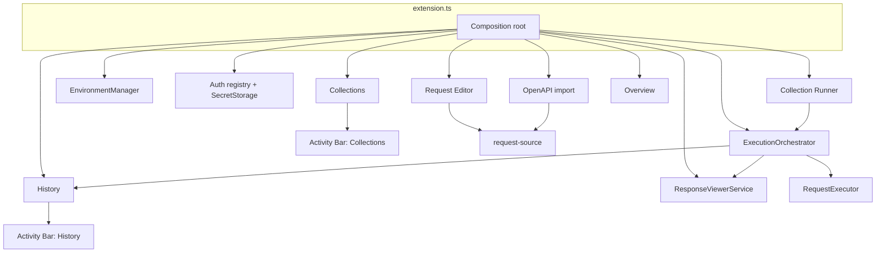

# Architecture

API Hero is a VS Code extension with a layered design: domain modules stay free of `vscode` imports; adapters under `*/vscode/` register commands, views, and webviews. Composition happens in `src/extension.ts`.

Brand: **API Hero**. Machine IDs remain `apiRunner.*` — see [stable identifiers](../release/stable-identifiers.md).

## Extension composition



Activity Bar hosts **Collections** and **History** only. Environment Manager, Auth Manager, Overview, History Detail, Collection Run Report, OpenAPI wizard, and Response viewer are panels/editors opened on demand.

## Request lifecycle

```mermaid
sequenceDiagram
  participant UI as Editor / Collections
  participant O as ExecutionOrchestrator
  participant P as Parser + Validate
  participant V as VariableResolver
  participant A as AuthenticationResolver
  participant E as RequestExecutor
  participant R as Response viewer
  participant H as HistoryRecorder

  UI->>O: runAtPosition / runAtSourceLocation
  O->>P: parse + select + validate + build
  O->>V: resolve {{variables}}
  O->>A: apply auth profile
  O->>E: execute AuthenticatedRequest
  E-->>O: ExecutionResult
  O->>H: append metadata (if captured)
  O->>R: present (single-request; skipped in collection runs)
```

## Architecture Decision Records

| ADR | Status | Topic |
| --- | --- | --- |
| [ADR-0001](./adr/0001-variables-extraction-auth-dependencies.md) | Accepted | Variables, Response Extraction, Variable Manager, Authentication, Request Dependencies, Create Variable From Response |
| [ADR-0002](./adr/0002-authored-request-ids.md) | Accepted | Human-readable `@depends-on` refs; runtime discovery IDs only |
| [ADR-0003](./adr/0003-intelligent-variable-dependency-autofill.md) | Accepted | Autofill is editor projection of one dependency engine; Auto never persisted |
| [P0 Implementation Spec](./adr/0001-phase-0-implementation-spec.md) | Ready | Exact Phase 0 build checklist (files, APIs, tests) — not an ADR |
| [P1 Implementation Spec](./adr/0001-phase-1-implementation-spec.md) | Ready | Exact Phase 1 extraction build checklist — not an ADR |
| [P1 Task Plan](./adr/0001-phase-1-task-plan.md) | Ready | Developer tasks P1-001…019 for tracking / sequential commits |
| [P2 Implementation Spec](./adr/0001-phase-2-implementation-spec.md) | Complete | Collection runner store, `@depends-on`, graph, collection variables |

**ADR-0001** is authoritative for extraction, scopes, auth-vs-variables, and dependency chaining fundamentals. **ADR-0002** governs persisted depend refs. **ADR-0003** governs Intelligent Variable & Dependency Autofill (one engine, projection-only editor, no Auto persistence). Domain docs describe the **shipped** system; where they conflict with these ADRs on future work, the ADRs win until docs are updated during implementation.

## Domain docs

| Topic | Document |
| --- | --- |
| Parser | [parser.md](./parser.md) |
| Validation | [validation.md](./validation.md) |
| Request builder | [request-builder.md](./request-builder.md) |
| Request source | [request-source.md](./request-source.md) |
| Request editor | [request-editor.md](./request-editor.md) |
| Runtime | [runtime.md](./runtime.md) |
| Execution | [execution.md](./execution.md) |
| Request execution pipeline | [request-execution-pipeline.md](./request-execution-pipeline.md) |
| Variables | [variables.md](./variables.md) |
| Variable IntelliSense | [variable-intellisense.md](./variable-intellisense.md) |
| Authentication | [authentication.md](./authentication.md) |
| Response | [response.md](./response.md) |
| Assertions | [assertions.md](./assertions.md) |
| Collections | [collections.md](./collections.md) |
| CRUD prompt dialogs | [crud-prompt-dialogs.md](./crud-prompt-dialogs.md) |
| Collection runner | [collection-runner.md](./collection-runner.md) |
| History | [history.md](./history.md) |
| OpenAPI import | [openapi-import.md](./openapi-import.md) |

## Related

- [Development](../development/README.md)
- [User guide](../user/getting-started.md)
