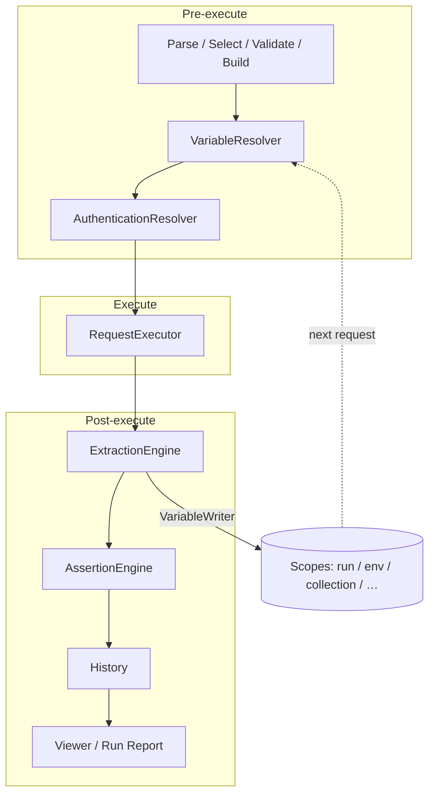

# ADR-0001: Variables, Extraction, Authentication & Request Dependencies

| Field | Value |
| --- | --- |
| Status | **Accepted** |
| Date | 2026-07-25 |
| Deciders | Product / Engineering |
| Scope | Response Variable Extraction, Variable Manager, Authentication, Request Dependencies, Create Variable From Response UI |
| Supersedes | Standalone design proposals for the topics above (architecture-only; not yet implemented) |
| Authority | **This ADR is the single authoritative architecture document for all future implementation work in this scope.** Conflicting recommendations in prior proposals are resolved here. |

### Source proposals consolidated

| Topic | Prior design session |
| --- | --- |
| Response Variable Extraction | [RVE design](89b1fdf7-9286-49ce-bfbd-5c52ed5bf577) |
| Create Variable From Response UI | [Create-from-response UX](06e51c71-86fb-42a2-a0b0-fb2f0e37097f) |
| Authentication | [Auth recommendation](609f92a4-9a0d-437e-8a6b-cec5849dd468) |
| Request Dependencies | [Dependencies A](94587042-b9d3-45d4-88fc-d6295a4ea060), [Dependencies B](6b185b36-38ab-474d-8167-1b4b4e0388a2) |
| Variable Manager | No standalone design existed; defined in this ADR from UI-first vision + RVE Environment Manager evolution |

---

## 1. Context

API Hero today has:

- Static `{{name}}` resolution across **document → environment → workspace → global**
- Profile-based **Authentication** after variable resolution (Bearer, API Key, Basic; SecretStorage for secrets)
- Post-response **Assertions** with shared JSON-path reads (validation only)
- Sequential **Collection Runner** with reserved opaque bags for `dependencies` and `variablesPerRun`

What is missing is the bridge that turns response values into variables, shares them across chained requests, and exposes a coherent UX for creating and managing those variables — without inventing a parallel token vault or a second HTTP stack.

This ADR freezes the target architecture so implementation can proceed in phases without redesign churn.

---

## 2. Decision summary

1. **One variable system** — All dynamic values (tokens, IDs, cursors, CSRF) are variables with scopes and sensitivity. There is no separate token vault.
2. **One extraction system** — Declarative rules on requests capture values from responses. Auth, dependencies, and UI all use this system.
3. **Auth stays scheme-aware** — Profiles decorate requests; they **consume** variables/secrets. They do not own login parsing. OAuth/refresh are future auth-provider orchestration on top of extraction.
4. **Request dependencies are data-flow** — Edges come from producer/consumer variables (plus optional explicit `@depends-on`). Collection runs gain a mutable **`run`** scope.
5. **Variable Manager** — Evolve Environment Manager into a unified **Variable Manager** covering persisted scopes; **run** is inspect-only and never mixed into editable persisted scopes.
6. **Create Variable From Response** — Select-then-act UX in the Response Viewer that writes extraction rules (Mode B). Snapshot Mode A is a temporary Phase-0 UX fallback only if DSL is not yet ready.

---

## 3. Conflict resolutions (canonical)

Prior proposals disagreed. These decisions are final for implementation.

| Conflict | Chosen decision | Rationale |
| --- | --- | --- |
| Extract **syntax** | Directive form: `@extract` / `@sensitive-extract` with `from` + optional `scope=` / `when=` | Git-friendly, matches `@variable` / `@auth`, supports both ephemeral and persisted targets |
| Bare `extract …` lines (expect-style) | **Rejected** as primary | Prefer consistent directive grammar; avoid a second line-class alongside `expect` |
| Default extract **target scope** | **`run`** when omitted in `.api` | Unlocks Login→next-request without overwriting env by accident |
| UI “Save as variable” default scope | **Environment** (user can change) | Persistent intent from Response Viewer; sheet always confirms |
| RVE default `scope=environment` on every rule | **Superseded** | Persistence is explicit via `scope=`; omit ⇒ `run` |
| Precedence: `run` vs `document` | **`run` > `document` > `environment` > `collection` > `workspace` > `global`** | Live chain values must beat static document defaults during a run |
| Collection scope placement | Between **environment** and **workspace** | Active environment overrides collection defaults (Postman-like) |
| Extract vs assertion order | **Extract after transport success; not gated by assertion pass by default** | Assertions remain validation; optional `when=assertions:pass` per rule |
| Extract failure severity | **Required** extract miss ⇒ request **failed**; **optional** ⇒ warning | Fail-closed for chains; non-fatal only when marked optional |
| RVE “extraction never blocks viewer” | **Retained for viewer presentation** | Request outcome may still be `failed`; viewer still shows result + extraction report |
| Collapse auth into header templates only | **Rejected** | Keep profiles for encoding, conflict detection, masking |
| Parallel token vault | **Rejected** | Variables + SecretStorage + run store only |
| Graph editor in v1 | **Deferred** | Tree + Extract tab + Run Report sufficient |
| Separate “Variable Manager” module name in product | **Yes (UI rename/evolution)** | Implementation may keep `EnvironmentManager` core and expand; user-facing name becomes Variable Manager |
| Mode A snapshot vs Mode B rules | **Mode B is the product**; Mode A only as interim if Phase 1 ships UI before parser | Avoid permanent dual persistence models |
| `@depends` vs `@depends-on` | **`@depends-on`** | Explicit verb; comma-separated request names |
| Auto-reorder on collection run | **Silent topo reorder + toast** summarizing changes | Confirm dialog is optional setting later |
| Promote run → environment | **Explicit user action only** | Never auto-persist run values |

---

## 4. Canonical variable model

### 4.1 Scopes

| Scope | Code id | Mutable during run? | Persisted? | Editable in Variable Manager? |
| --- | --- | --- | --- | --- |
| Run | `run` | Yes (extractors) | No (ephemeral) | Inspect-only after/during run |
| Request / Document | `document` | Overlay yes; `.api` `@variable` static | Rules in `.api`; values overlay by default | Request Editor Variables / Extract tabs |
| Environment | `environment` | Via extract `scope=environment` | `.apihero/environments/*.json` (+ sensitive overlay) | Yes |
| Collection | `collection` | Via extract `scope=collection` | `Collections/<Name>/api-hero.variables.json` (+ local overlay) | Yes |
| Workspace | `workspace` | Via extract `scope=workspace` | `.apihero/workspace.json` (+ overlay) | Yes |
| Global | `global` | Manual only | User settings | Yes |
| Secrets (auth) | N/A (SecretStorage) | Via auth profile `kind: secret` | VS Code SecretStorage | Auth Manager |

**Forbidden:** Extracting into `global` (manual only).  
**Forbidden:** Auto-writing run values into SecretStorage without an explicit persistence policy / promote action.

### 4.2 Precedence (highest wins)

```text
run > document > environment > collection > workspace > global
```

Resolution merges definitions into one effective map, then expands `{{name}}` with existing cycle detection. Sensitivity propagates transitively (unchanged).

### 4.3 Name pattern

Unchanged: `[A-Za-z_][A-Za-z0-9_.-]*`.

---

## 5. Response Variable Extraction (RVE)

### 5.1 Purpose

Declarative rules on a request that, after HTTP execution, read values from the **canonical `ExecutionResult`** (never from masked presentation) and write them into the chosen scope through a single `VariableWriter`.

### 5.2 Syntax (canonical)

```api
@extract accessToken from body.access_token
@sensitive-extract refreshToken from body.refresh_token scope=environment
@extract productId from body.data[0].id scope=run optional
@extract requestId from header X-Request-Id when=status:2xx
@depends-on Login, Products
```

**Grammar (normative):**

```ebnf
extractDirective   ::= ("@extract" | "@sensitive-extract") SP name SP "from" SP source options*
source             ::= "body." jsonPath | "header" SP headerName | "status"
options            ::= scopeOpt | whenOpt | "optional" | "sensitive" | "required"
scopeOpt           ::= "scope=" ("run" | "document" | "collection" | "environment" | "workspace")
whenOpt            ::= "when=" whenClause
whenClause         ::= "status:" statusSpec | "assertions:pass" | "content-type:" mime
statusSpec         ::= DIGIT+ | DIGIT "xx"
dependsDirective   ::= "@depends-on" requestName ("," SP? requestName)*
```

| Default | Value |
| --- | --- |
| `scope` when omitted | `run` |
| `@sensitive-extract` | `sensitive: true` |
| Requiredness | `required` unless `optional` |
| `when` when omitted | Transport success (response received); cancelled skips extraction |

JSON paths **must** reuse the shared path engine with assertions (`body.user.id`, `body.items[0].id`). Promote `assertions/json-path.ts` to a shared module.

Zone association for multi-request `.api` files mirrors `expect` / assertion zones.

### 5.3 Engine behavior

For each enabled rule after execute:

1. Skip if cancelled / no response when source needs body/headers
2. Evaluate `when`
3. Resolve path via extractor registry (v1: json-path + header + status)
4. Coerce to string (`null` → `""`; object/array → `JSON.stringify`)
5. `VariableWriter.write({ name, value, scope, sensitive })`
6. Record outcome in `ExtractionReport` (masked values only for UI)

**Overwrite:** Last writer wins within a run for the same name; emit a plan-time or run-time warning when multiple producers write the same variable without a clear chain.

### 5.4 Persistence by scope

| Target scope | Where value lands |
| --- | --- |
| `run` | `RunVariableStore` for current collection/file/selected run |
| `document` | `RuntimeVariableOverlay` keyed by request identity (does **not** rewrite `.api` unless user chooses Persist) |
| `collection` | `api-hero.variables.json` under collection root; sensitive → `variables.local.json` collections map |
| `environment` | Active environment store; sensitive → local overlay |
| `workspace` | Workspace store; sensitive → local overlay |

History stores **names and counts only**, never extracted values.

---

## 6. Variable Manager

### 6.1 Definition

**Variable Manager** is the unified UI for creating, editing, comparing, and inspecting **persisted** variables across Environment, Collection, Workspace, and Global scopes. It is the evolution of today’s Environment Manager panel — not a second competing product.

### 6.2 Responsibilities

| In scope | Out of scope |
| --- | --- |
| CRUD for env / collection / workspace / global variables | Editing `run` values (inspect + Promote only) |
| Environment CRUD (create/rename/delete/duplicate/switch) | Auth SecretStorage secrets (Auth Manager) |
| Show `source: manual \| extraction` metadata | Defining extract rules (Request Editor Extract tab / Response Viewer) |
| Filter “Show extracted variables” | Graph / dependency editing |
| Refresh after extraction writes | |

### 6.3 Request-scoped variables

Remain primarily in the **Request Editor** (Variables + Extract tabs). Variable Manager may deep-link “Open request variables” but does not become the editor for `.api` document variables.

### 6.4 Write path

All writes go through `VariableWriter` → existing stores (`EnvironmentManager` / project-store / collection variable store / overlay). No direct webview writes to settings JSON.

---

## 7. Authentication

### 7.1 Three-layer model (normative)

```text
Layer 1  Response Variable Extraction   → produces variables
Layer 2  Variable scopes (incl. run)    → store / resolve {{name}}
Layer 3  Authentication providers       → scheme-aware decoration
```

### 7.2 By auth type

| Type | Decision |
| --- | --- |
| Static Bearer / API Key | Keep auth profiles; prefer `kind: secret` or `kind: variable` |
| Basic | Keep dedicated provider (Base64 + validation) |
| Login API → token | **Extraction**, not a special auth feature |
| Refresh token | Capture via extraction; **refresh orchestration** is a future auth lifecycle hook |
| OAuth2 / OIDC | Future specialized **provider** that may perform network flows **only through the orchestrator**; writes tokens via extraction/storage APIs; decorates like bearer |

### 7.3 Preferred dynamic pattern

```api
POST {{host}}/auth/login
Content-Type: application/json

{ "user": "{{user}}", "password": "{{password}}" }

@sensitive-extract accessToken from body.access_token
@auth apiBearer
###
GET {{host}}/products
@auth apiBearer
```

Where profile `apiBearer` binds `token: { kind: "variable", name: "accessToken" }`.

Manual `Authorization: Bearer {{accessToken}}` remains an escape hatch; it is **not** the recommended primary path (loses conflict detection and masking guarantees).

### 7.4 Boundary change

Today’s docs state auth does not perform network flows or persist variables. **This ADR revises that for future OAuth/refresh providers only:** they may initiate orchestrated network flows and update stores via VariableWriter — they must not bypass `ExecutionOrchestrator` or duplicate HTTP transport.

---

## 8. Request Dependencies

### 8.1 Model

Dependencies are derived from:

1. **Produces** — variables written by `@extract` / `@sensitive-extract`
2. **Consumes** — `{{name}}` references in URL, headers, body, auth refs, directives
3. **Explicit** — `@depends-on …` (ordering-only or additional constraints)

Identity (see [ADR 0002](./0002-authored-request-ids.md)):

- **Depend refs** — `@depends-on Login` or `Authentication/Login` (human-readable; no `req_*`).
- **Display** `@name` — editable; duplicates allowed across folders; same-folder duplicates fail closed.
- **Discovery** `request:<path>#<index>` — plan membership / graph nodes only; never persisted in `@depends-on`.

Resolve depend refs once at plan-build → ID edges. Ambiguous bare names ⇒ diagnostic + Quick Fix (do not guess).

### 8.2 Plan building

```text
WorkspaceCollections snapshot
  → membership (collection / folder / selected)
  → parse produces + consumes + @depends-on
  → DependencyGraph
  → cycle detection (block run on cycle)
  → topological sort (tie-break: tree / caller ordinal)
  → missing-producer analysis
  → RunPlan + typed extensions.dependencies / variablesPerRun
```

If no extractors and no `@depends-on`, order equals today’s DFS (no behavior change).

### 8.3 Failure policy (collection runs)

| Event | stop-on-first-error | continue-on-error | skip-invalid |
| --- | --- | --- | --- |
| Required extraction failed | failed + stop | failed + continue | skip request |
| Missing run var at pre-flight | skip dependents | skip request | skip request |
| Assertion failed | failed (existing) | continue | continue |
| User cancel | cancelled remainder | same | same |

Default skip message form:

```text
Missing run variable: accessToken (producer Login failed)
```

Settings (additive):

- `apiRunner.dependencies.blockUnresolvedPlan` (default: warn; may block)
- `apiRunner.dependencies.extractionFailurePolicy`: `fail-request` (default) | `warn-and-continue` (forces optional-like behavior)

### 8.4 Circular dependencies

| Class | Handling |
| --- | --- |
| Variable definition cycles | Existing resolver DFS |
| Request producer cycles | Plan-time block with path report |
| Self `@depends-on` | Validation error |
| Same request consumes `v` and extracts `v` | Allowed only if a lower-scope seed exists for the resolve phase |

---

## 9. Canonical execution pipeline

### 9.1 Single-request

```text
parse → select → validate → buildSelectedRequest
  → VariableResolver (static scopes + document overlay + run if present)
  → AuthenticationResolver
  → RequestExecutor
  → ExtractionEngine (transport success + when)
  → AssertionEngine
  → History (optional extraction name counts)
  → Response Viewer (result + extraction report + assertions)
  → Variable Manager refresh if persisted scopes written
```

### 9.2 Collection / folder / selected / future Run File

```text
buildRunPlan (dependency-aware)
  → create empty RunVariableStore
  → for each PlannedRequest in topo order:
       merge run snapshot into VariableResolver definitions
       pre-flight required consumed run vars
       runAtSourceLocation (same pipeline as §9.1)
       commit extractions into RunVariableStore
       apply failure policy
  → discard RunVariableStore
  → Collection Run Report (order, +vars, reorder notes)
```

`ExecutionOrchestrator` remains the only HTTP choke point. Extraction and assertions are post-execute stages; Collection Runner owns run-store lifecycle.



---

## 10. Storage model

| Artifact | Contents |
| --- | --- |
| `.api` | `@variable`, `@sensitive-variable`, `@extract`, `@sensitive-extract`, `@depends-on`, `@auth` |
| `api-hero.collection.json` | Ordering + optional `extensions.dependencies.explicit` overrides (secondary) |
| `Collections/<Name>/api-hero.variables.json` | Non-sensitive collection variables |
| `.apihero/environments/*.json` | Environment variables |
| `.apihero/workspace.json` | Workspace variables |
| `.apihero/local/variables.local.json` | Sensitive overlays (env / workspace / **collections**) — gitignored |
| User settings | Global variables; auth profile metadata |
| SecretStorage | Auth secrets only |
| `RunVariableStore` | Memory only for active run |
| History | Secret-free; extraction **names/counts** only |

**Not stored:** Run-scoped values; raw extracted secrets in history; duplicate token vaults.

---

## 11. Variable lifecycle

```text
Define rule (@extract / UI Save as variable)
  → Run request
  → Extract (if when satisfied)
  → Write to target scope
  → Subsequent resolve sees new value (precedence)
  → Run ends → run scope discarded
  → Persisted scopes remain until user deletes or next overwrite
  → Optional: Promote run → environment (explicit)
  → Optional: Persist document overlay → @variable (explicit)
```

| Phase | Actor |
| --- | --- |
| Author | User / OpenAPI import (no auto-extract) |
| Capture | ExtractionEngine |
| Resolve | VariableResolver |
| Apply (HTTP creds) | AuthenticationResolver |
| Inspect | Response Viewer, Run Report, Variable Manager, Request Editor |
| Dispose | Run end / overlay clear / user delete |

---

## 12. Create Variable From Response UI

### 12.1 Interaction (normative)

**Select-then-act** in Response Viewer:

1. Select JSON scalar leaf or header value (requires `data-json-path` in tree)
2. Entry points: hover/focus row action, context menu, toolbar **Save as variable**
3. Confirmation **sheet** (not blind one-click): name, path (read-only + copy), scope picker, sensitive checkbox, value preview (masked if needed), overwrite warning
4. Host validates path against **full** `ExecutionResult` and persists rule/value
5. Toast: Open Variables / Insert `{{name}}`

Defaults: name from leaf key (sanitized); sensitive heuristic for `*token*`, `*secret*`, `*password*`, `*api_key*`, `Authorization`; default scope **Environment**.

### 12.2 Persistence target

| Mode | When |
| --- | --- |
| **B — Extraction rule** (canonical) | Writes `@extract` / `@sensitive-extract` (Request) or extract+write to env/workspace/collection stores |
| **A — Snapshot** | Interim only: write static `@variable` / env value if DSL not yet available |

Reject as primary: always-visible `+`, double-click extract, drag-to-editor, fifth “Extraction” scope, Set-Cookie extract (until cookie jar).

### 12.3 Surfaces after save

Request Editor Extract/Variables tabs; Variable Manager for persisted scopes; IntelliSense immediate refresh.

---

## 13. UI surfaces (consolidated)

| Surface | Role |
| --- | --- |
| Request Editor — Extract tab | CRUD extraction rules; path preview |
| Request Editor — Variables tab | Document vars + last-run / overlay indicators |
| Response Viewer — Extracted Variables | Report + Save as variable entry |
| Variable Manager | Persisted scopes + extraction metadata |
| Collections tree | Dependency badges; **Run with dependencies** |
| Collection Run Report | Topo order, +extracted names, reorder toast summary |
| Problems | `api-hero-dependencies` + extraction diagnostics |
| Auth Manager | Profiles only; not variable CRUD |
| Output: API Hero Run Trace | Secret-free resolve/extract log |

No dedicated flow designer in Phases 0–2.

---

## 14. Module layout (target)

```text
src/extraction/           # RVE core (framework-neutral)
  models.ts
  extract.ts              # Zone association
  engine.ts
  json-path-extractor.ts
  variable-writer.ts
  runtime-overlay.ts
  index.ts

src/extraction/shared/
  json-path.ts            # Promoted from assertions

src/dependencies/         # Graph / plan enricher (framework-neutral)
  models.ts
  graph-builder.ts
  cycle-detector.ts
  plan-enricher.ts
  index.ts

src/variables/
  run-variable-store.ts
  collection-variable-store.ts
  variable-resolver.ts    # Extended scopes + precedence
  # EnvironmentManager evolves toward Variable Manager ports

src/orchestration/        # Post-execute extraction + assertion hooks
src/collection-runner/    # Run store lifecycle; dependency-aware plans
src/extraction/vscode/    # Problems, viewer messages
src/dependencies/vscode/  # Badges, dry-run validate, inspector (later)
```

Populate reserved bags with **typed** payloads (stop using opaque placeholders once implemented):

- `CollectionRunExtensionBag.variablesPerRun`
- `CollectionRunExtensionBag.dependencies`
- `ExtensionBag.collectionVariables` → realized via `api-hero.variables.json`

Domain barrels must not import `vscode`.

---

## 15. Explicitly deferred

Do **not** implement under this ADR’s early phases:

| Deferred | Notes |
| --- | --- |
| OAuth2 / OIDC provider | Builds on Layers 1–3 later |
| Refresh / 401 retry orchestration | Auth lifecycle extension |
| Cookie jar / Set-Cookie extract | Separate subsystem |
| Parallel request execution | `parallel` bag remains reserved |
| Conditional branching | `conditional` bag remains reserved |
| Pre/post JS scripts | Assertions extension bag |
| Regex / XML / XPath extractors | Registry extension after json-path + header |
| `when=assertions:pass` as default | Available as per-rule option only |
| Graph / Flow designer webview | Phase 3+ optional |
| Step-through debugger | Phase 3+ |
| Dependency inspector panel | Phase 3+ |
| Auto-persist run → environment | Never automatic |
| Extract into `global` | Forbidden |
| CLI / CI runner | Same contracts later; out of scope now |
| Postman import of `pm.environment.set` | Import Hub later |
| Built-ins `$uuid` / `$timestamp` evaluation | Still unsupported until separate ADR |
| Collection-run extract UX in Run Report queue | Phase 2+ |
| Save & Insert into Request Editor | Phase 2 UX |
| History replay → create extract | Open; default = current run only until designed |

---

## 16. Phased implementation roadmap

Phases are sequential. A phase is done only when its acceptance criteria pass (tests + docs update). Later phases must not reopen §3 decisions without a new ADR.

### Phase 0 — Foundations (no user-facing chaining yet)

- Promote shared JSON-path module
- Extend `VariableScope` with `collection` and `run` (empty stores; precedence wired)
- Introduce `VariableWriter` ports + `RuntimeVariableOverlay` + `RunVariableStore` stubs
- Orchestrator: `PostExecutionObserver` seam (extraction no-op)
- Docs: this ADR linked from architecture README; mark prior proposals as superseded

**Exit:** Types compile; existing tests green; precedence unit tests for empty new scopes.

**Normative implementation checklist:** [0001-phase-0-implementation-spec.md](./0001-phase-0-implementation-spec.md) (exact files, frozen interfaces, tests, out-of-scope).

### Phase 1 — Extraction core + Variable Manager evolution

- Parser: `@extract` / `@sensitive-extract` round-trip in request-source
- `ExtractionEngine` + json-path/header/status extractors
- Wire post-execute extraction; write `run` + `environment` + `document` overlay
- Collection variables file + local overlay schema bump *(deferred to Phase 2+ by P1 implementation spec)*
- Request Editor **Extract** tab
- Evolve Environment Manager → **Variable Manager** (collection scope + extraction metadata) *(P1: refresh after extraction only; rename/collection UI deferred)*
- Response Viewer: **Extracted Variables** section (report only)

**Exit:** Single request can extract to environment/run overlay; `{{name}}` resolves on next single run after env write; secrets masked.

**Normative implementation checklist:** [0001-phase-1-implementation-spec.md](./0001-phase-1-implementation-spec.md).

### Phase 2 — Collection chaining & dependencies

- Collection Runner: shared per-run `RunVariableStore`, commit after each request
- Dependency graph from produces/consumes; topo sort; cycle block; missing-var skip
- `@depends-on` directive
- `CollectionVariableStore` + `api-hero.variables.json` (+ local sensitive overlay)
- Run Report: order, +vars, reorder toast, skip reasons
- *(Deferred from this phase by P2 implementation spec: Create Variable From Response, Problems dependency source)*

**Exit:** Login → extract token → Products works in Run Collection without manual env seeding.

**Normative implementation checklist:** [0001-phase-2-implementation-spec.md](./0001-phase-2-implementation-spec.md).

### Phase 3 — Hardening & UX polish

- Dry-run **Validate Dependencies**
- Run with dependencies (transitive producers)
- Save & Insert; overwrite confirmations; promote run → environment
- Header extract polish; optional extract; stricter settings
- Auth profile binding guidance in UI (variable-bound bearer)

**Exit:** Partial runs actionable; promote path documented; no High-severity secret leakage findings.

### Phase 4 — Debug & advanced (optional)

- Step-through collection runs
- Dependency inspector list view
- Run Trace output channel
- Re-run from step (live upstream chain)

### Phase 5 — Auth orchestration (separate mini-roadmap, depends on 1–3)

- OAuth2 provider using orchestrator + VariableWriter
- Refresh pre-auth hook
- Explicit SecretStorage persistence policy for long-lived tokens

---

## 17. Acceptance principles (all phases)

1. **Git-first** — Rules and depends live in `.api` text
2. **One orchestrator** — No duplicate HTTP stack
3. **One path language** — Shared with assertions
4. **Fail closed** on cycles and required missing producers
5. **Secrets safe** — Mask in UI/history/trace; sensitive overlay / SecretStorage only
6. **Additive** — Collections without extract/depends behave as today
7. **Auth complementary** — Extraction produces; auth applies schemes

---

## 18. Documentation impact

When implementation starts:

| Document | Action |
| --- | --- |
| [architecture/README.md](../README.md) | Link this ADR as authoritative for variables/extraction/auth-deps |
| [variables.md](../variables.md) | Update scopes, precedence, run/collection; point to ADR |
| [authentication.md](../authentication.md) | Revise “no network / no persist” boundary; point to ADR |
| [collection-runner.md](../collection-runner.md) | Replace opaque bags with typed dependency/run-store behavior |
| [request-execution-pipeline.md](../request-execution-pipeline.md) | Insert extraction stage |
| [assertions.md](../assertions.md) | Clarify shared JSON-path; extraction ≠ assertion |
| [response.md](../response.md) | Create-from-response + extraction report |
| User docs | Update when Phase 1+ ships |

Prior proposal write-ups in chat are **non-normative**. If a chat proposal conflicts with this ADR, **this ADR wins**.

---

## 19. Consequences

### Positive

- Login→token→API chains without scripts or Postman-like JS
- Single mental model for tokens, IDs, and cursors
- Auth remains secure and scheme-correct
- Clear implementation order reduces redesign risk

### Negative / costs

- Precedence change (new scopes) requires exhaustive `VariableScope` switch updates
- Parser/request-source/language-support surface area grows
- Collection runner complexity (graph + store) increases
- Users must learn `@extract` / scope defaults (`run` vs Environment UI default)

### Risks & mitigations

| Risk | Mitigation |
| --- | --- |
| Accidental env overwrite | Default `.api` scope = `run`; UI confirms scope |
| Secret leakage | Masking; host-side extract from full result; history names only |
| Silent reorder confusion | Toast + Run Report order column |
| Dual Mode A/B persistence drift | Mode A interim only; delete when Mode B ships |

---

## 20. Amendment policy

Changes to §3 conflict resolutions, §4 precedence, §5 syntax, §9 pipeline, or §15 deferred list require a new ADR (`ADR-0002+`) that explicitly supersedes the affected sections. Implementation bugs and UI polish do not require a new ADR.
