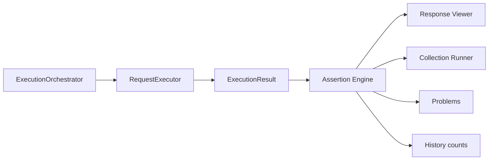

# Assertions & Testing Framework

Transport-independent Assertion Engine for API Hero. It evaluates completed
`ExecutionResult` values only — it **never** executes HTTP.

See [request-execution-pipeline.md](./request-execution-pipeline.md) for the live
run path. Assertions are a downstream observer of that path, parallel to
[history.md](./history.md).

## Pipeline

```text
ExecutionResult
  → Assertion Engine (evaluateAssertions)
  → AssertionResults / TestReport / AssertionSummary
  → Response Viewer / Collection Runner / Problems / History counts
```



## Lifecycle / orchestrator hook

After `RequestExecutor.execute` returns (and the run is still current):

1. Extract `expect` lines for the selected request (dedicated extractor).
2. Evaluate assertions against the `ExecutionResult`.
3. Commit history (optional secret-free assertion **counts** only).
4. Notify the Problems observer (post-run only — never on keystroke).
5. Show the response viewer when `showViewer` is true, including assertion UI.

### When assertions run

| Outcome | Evaluate assertions? |
| --- | --- |
| HTTP success (`success: true`), including 4xx/5xx status on a completed response | **Yes** — assertions validate the response |
| Transport / execution failure with no response body | **Yes** — subjects that need a response fail with a clear reason |
| Cancelled at transport (`CANCELLED`) | **No** (skipped) |
| Precondition failure before `execute` | **No** (no `ExecutionResult`) |
| Replaced / stale run | **No** |

**Test runner:** unit tests use **node:test** (not Vitest). This matches the rest
of the repository; Vitest was not added solely for wording.

## Expect-line association rule

Assertions are associated with requests using `ApiDocument` request ranges +
source text. A **minimal additive parser change** skips `expect` lines inside
`parseRequest` so they are never headers or body (no grammar overhaul).

Association:

1. For request `i`, the zone is `[range.start_i, range.start_{i+1})` (or EOF).
2. Within that zone, non-comment lines whose first token is `expect` belong to
   request `i`.
3. Blank lines and separators (`###`) are ignored.
4. Lines before the first request are ignored.
5. Commented expects (`# expect …`, `// expect …`) are ignored.

The lexer excludes `expect` from unknown-HTTP-method diagnostics so these
lines do not fail runs as syntax errors.

Example:

```http
GET https://example.com/users/1
Accept: application/json

expect status == 200
expect header Content-Type contains "json"
expect body.user.name == "John"
###
POST https://example.com/users
expect status in [200,201]
```

## Syntax

```text
expect <subject> <operator> [value]
```

Subjects: `status`, `header <Name>`, `body` / `body.<path>`, `responseTime`,
`content-type`, `responseSize` (and documented aliases).

Operators: `==`, `!=`, `>`, `>=`, `<`, `<=`, `in`, `contains`, `exists`,
`isEmpty`, `isNull` (plus aliases such as `eq`, `gt`, `empty`).

JSON paths: `body.user.id`, `body.data.items[0].name`, `body.orders.length`.
Missing paths fail gracefully (no throws to the UI).

Malformed expect lines become structured `AssertionFailure` with
`malformed: true` — never stack traces.

## Domain models

Immutable types under `src/assertions/`:

| Type | Role |
| --- | --- |
| `Assertion` | Parsed declarative expect |
| `AssertionResult` | Pass / fail / skip / malformed |
| `AssertionFailure` | Expected / actual / reason / context / source |
| `AssertionSummary` / `TestSummary` | Counts + pass % + duration |
| `AssertionSuite` | Asserts for one request |
| `TestReport` | Full evaluation report |
| `ExecutionAssertionContext` | Transport-independent view of the result |
| `AssertionExtensionBag` | Reserved: custom / js / schema / snapshot / contract / AI |

## Engine

- Input: `ExecutionResult` + suite (+ optional malformed lines / source locations)
- Parses JSON body **once** and reuses it for all body/path assertions
- Masks secrets in reports (URL userinfo via `redactUrlUserinfo`; never dumps
  `Authorization` / cookie / API-key header values)

## Integrations

### Response Viewer

`presentExecutionResult(result, report?)` and the viewer HTML add an Assertions
section: summary, pass/fail indicators, expandable failure details. CSP and HTML
escaping are preserved.

### Collection Runner

After each orchestrator attempt that produced a report, `RequestRunResult`
carries assertion counts. Aggregate `RunStatistics` include
`assertionsPassed` / `assertionsFailed` / `assertionsTotal`.

**Failure policy:** when HTTP succeeds but assertions fail, the request outcome
is **failed**. **Stop on First Error** therefore stops after an assertion
failure. Continue-on-error / skip-invalid continue as usual.

Summary toast / status bar include assertion stats when `assertionsTotal > 0`.

### VS Code

- CodeLens **Run Tests** when the request has associated expects (maps to
  `apiRunner.runRequestWithAssertions`, same path as Run Request)
- Commands: `runRequestWithAssertions`, `runCollectionTests` (aliases)
- Problems: `AssertionProblemsService` updates diagnostics **after runs only**

### History

Optional `extensions.assertions` bag stores **counts only** (no assertion text,
expected/actual, or secrets). History still records HTTP success/failure from
the `ExecutionResult` itself — assertion failure does not rewrite that status.

## Layering

| Layer | Location | Responsibility |
| --- | --- | --- |
| Models | `src/assertions/models.ts` | Immutable types |
| Parse | `src/assertions/parse-expect.ts` | Expect-line → Assertion / Failure |
| Extract | `src/assertions/extract.ts` | Document → per-request suites |
| Engine | `src/assertions/engine.ts` | Evaluate against ExecutionResult |
| Mask | `src/assertions/mask.ts` | Secret-free report formatting |
| VS Code | `src/assertions/vscode/` | Problems + registration |

Domain barrel (`src/assertions/index.ts`) must not import `vscode`.
`extension.ts` composes via `registerAssertions` + orchestrator observer.

## Deferred (not implemented)

JS scripting / pre-post scripts, schema validation, snapshot / contract testing,
performance benchmarking suites, AI assertions, plugins, CLI runner, OAuth
testing helpers.
