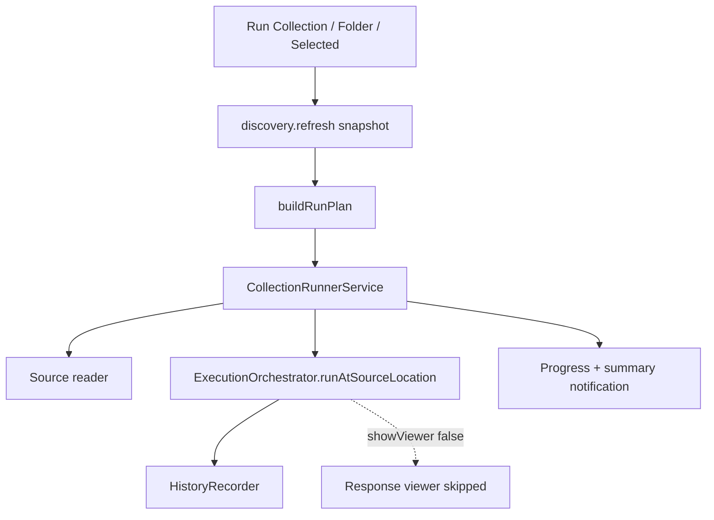

# Collection Runner

Sequential multi-request execution for API Runner collections. The runner
**reuses** [`ExecutionOrchestrator`](./request-execution-pipeline.md) for every
attempted request — parse → select → validate → build → variables → auth →
execute → History. It does **not** duplicate HTTP execution or history append
logic.

See [collections.md](./collections.md) for discovery/navigation and
[history.md](./history.md) for capture policy.

## Modes

| Mode | Command | Plan source |
| --- | --- | --- |
| Run Collection | `apiRunner.runCollection` | All requests under a collection (DFS) |
| Run Folder | `apiRunner.runFolder` | All requests under a folder (DFS, nested) |
| Run Selected Requests | `apiRunner.runSelectedRequests` | Selected tree request nodes (caller order) |

## Plan ordering

Plans are built from a **frozen** `WorkspaceCollections` snapshot:

1. Commands await `CollectionDiscoveryService.refresh()` once and pass the
   returned aggregate into `buildRunPlan` — they do not re-read a racing
   repository mid-build (see Collections concurrent-refresh debt).
2. Collection / folder order matches the Collections explorer depth-first walk:
   at each level, child folders are fully expanded before that level’s own
   requests (discovery sort). Example: folder `a` with nested `a/b` runs
   `a/b`’s requests before `a`’s own requests.
3. Selected-request mode preserves the caller’s id order and drops unknown ids.
4. Mid-run discovery refreshes do **not** mutate an in-flight plan.

## Failure policies

| Policy | Invalid / unread | Execution failure | Remaining requests |
| --- | --- | --- | --- |
| Stop on First Error | counted **failed** | stop | **skipped** |
| Continue on Error | counted **failed** | continue | run |
| Skip Invalid Requests | counted **skipped** | continue | run |

User cancellation always stops the run: the in-flight orchestrator attempt is
aborted when possible; remaining planned requests are marked **cancelled**.

## Orchestrator port

```text
CollectionRunnerService
  -> CollectionRequestExecutorPort.runAtSourceLocation(source, options)
  -> ExecutionOrchestrator (same pipeline + HistoryRecorder)
```

Collection runs call `runAtSourceLocation` with:

- `showViewer: false` — **no per-request response viewer** (avoids spam)
- `useProgressUi: false` — one collection-level progress notification instead
- `showNotifications: false` — failures roll into the run summary
- `signal` — collection-level cancellation aborts the active request
- `historyCaptureContext` — merge of the composition history provider
  (e.g. `environmentName`) with `collectionName` from the run plan

Single-request `runAtPosition` remains unchanged for Run Request / CodeLens /
History re-run and still opens the viewer.

## Viewer and history

**Design choice:** during a collection run the response viewer is suppressed for
every request. Completion is communicated via progress notification, status bar,
and a secret-free summary toast. History still records each network-attempted
(and cancelled-at-transport) request through the normal orchestrator capture
path — including cancelled in-flight attempts that reached `execute`.

**Residual UX debt:** the orchestrator may still update the single-request
status bar item while the collection run status bar is active (`useProgressUi`
suppresses progress UI, not status). Prefer a follow-up `updateStatus` option
rather than a second execution path.

## Layering

| Layer | Location | Responsibility |
| --- | --- | --- |
| Models | `src/collection-runner/models.ts` | Immutable run plan/result/summary + extension bags |
| Plan builder | `src/collection-runner/plan-builder.ts` | Snapshot → ordered `RunPlan` |
| Failure policies | `src/collection-runner/failure-policies.ts` | Stop / continue / skip-invalid |
| Runner service | `src/collection-runner/collection-runner.ts` | Sequential execute + progress events |
| VS Code adapters | `src/collection-runner/vscode/` | Commands, progress UI, source reader |

The domain barrel (`src/collection-runner/index.ts`) must not import `vscode`.
`extension.ts` composes via `registerCollectionRunner` after
`registerCollections`.



## Progress

`RunProgressEvent` exposes phase, current request, completed/remaining/total,
and elapsed time. The VS Code adapter drives one cancellable notification plus
a status bar item for the whole run.

## Extension bags (deferred)

`CollectionRunExtensionBag` reserves opaque keys for parallel execution,
conditionals, dependencies, variables-per-run, CI/CLI, reports, AI, and export.
**Assertion outcomes are first-class on `RequestRunResult` / `RunStatistics`**
(see [assertions.md](./assertions.md)) — do not re-home them solely in the
opaque `assertions` bag.

## Explicit exclusions

Parallel execution, scheduling, CI, cloud, and AI remain out of scope for this
subsystem. Assertion scripting / schema / snapshot features are deferred in the
Assertion Engine — see [assertions.md](./assertions.md).

## Testing

`node:test` under `src/collection-runner/*.test.ts` covers plan building,
sequential order, failure policies, cancellation, summary stats, progress
events, and large-plan ordering with a fake orchestrator port.
