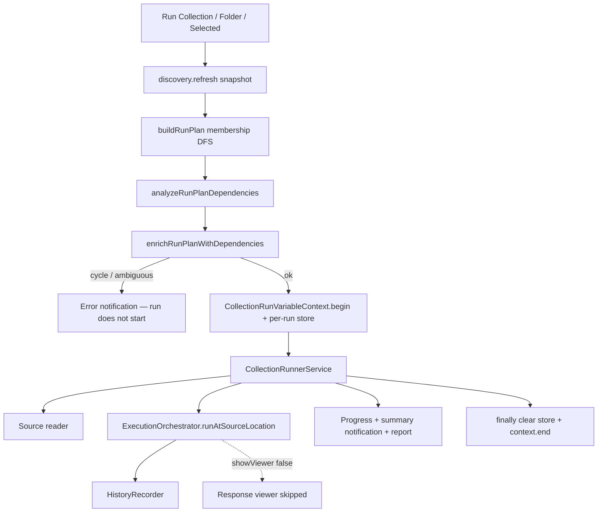

# Collection Runner

Sequential multi-request execution for API Hero collections. The runner
**reuses** [`ExecutionOrchestrator`](./request-execution-pipeline.md) for every
attempted request — parse → select → validate → build → variables → auth →
execute → History. It does **not** duplicate HTTP execution or history append
logic.

See [collections.md](./collections.md) for discovery/navigation and
[history.md](./history.md) for capture policy.

## Modes

| Mode | Command | Plan source |
| --- | --- | --- |
| Run Collection | `apiRunner.runCollection` | All requests under a collection (DFS) |
| Run Folder | `apiRunner.runFolder` | All requests under a folder (DFS, nested) |
| Run Selected Requests | `apiRunner.runSelectedRequests` | Selected tree request nodes (caller order) |

## Plan ordering

Plans are built from a **frozen** `WorkspaceCollections` snapshot:

1. Commands await `CollectionDiscoveryService.refresh()` once and pass the
   returned aggregate into `buildRunPlan` — they do not re-read a racing
   repository mid-build (see Collections concurrent-refresh debt).
2. Collection / folder order matches the Collections explorer depth-first walk:
   at each level, child folders are fully expanded before that level’s own
   requests (discovery sort). Example: folder `a` with nested `a/b` runs
   `a/b`’s requests before `a`’s own requests.
3. Selected-request mode preserves the caller’s id order and drops unknown ids.
4. Mid-run discovery refreshes do **not** mutate an in-flight plan.

## Failure policies

| Policy | Invalid / unread | Execution failure | Remaining requests |
| --- | --- | --- | --- |
| Stop on First Error | counted **failed** | stop | **skipped** |
| Continue on Error | counted **failed** | continue | run |
| Skip Invalid Requests | counted **skipped** | continue | run |

User cancellation always stops the run: the in-flight orchestrator attempt is
aborted when possible; remaining planned requests are marked **cancelled**.

## Orchestrator port

```text
CollectionRunnerService
  -> CollectionRequestExecutorPort.runAtSourceLocation(source, options)
  -> ExecutionOrchestrator (same pipeline + HistoryRecorder)
```

Collection runs call `runAtSourceLocation` with:

- `showViewer: false` — **no per-request response viewer** (avoids spam)
- `useProgressUi: false` — one collection-level progress notification instead
- `showNotifications: false` — failures roll into the run summary
- `signal` — collection-level cancellation aborts the active request
- `historyCaptureContext` — merge of the composition history provider
  (e.g. `environmentName`) with `collectionName` from the run plan

Single-request `runAtPosition` remains unchanged for Run Request / CodeLens /
History re-run and still opens the viewer.

## Viewer and history

**Design choice:** during a collection run the response viewer is suppressed for
every request. Completion is communicated via progress notification, status bar,
a secret-free summary toast, and the **Collection Run Report** panel
(`run-report-panel.ts` / `run-report-html.ts`). History still records each
network-attempted (and cancelled-at-transport) request through the normal
orchestrator capture path — including cancelled in-flight attempts that reached
`execute`.

The report's `CollectionRunReportModel` (Phase 2) additionally surfaces the
dependency-aware execution order: an "Execution order" header with a
"Reordered" badge when `dependencies.reordered` is true, per-row produced
variable names (`+accessToken`, never values) and skip reasons, a text-only
`Login → Products (accessToken)` dependency edge list, and an "Unresolved"
list of variables with no in-plan producer. There is no graph/canvas
rendering — text only, by design. `register-collection-runner.ts` also shows
a `Reordered N requests for dependencies` toast after a reordered run
completes, and blocks the run before it starts (with a cycle-path error
notification) when `enrichRunPlanWithDependencies` reports a cycle.

Default failure policy is configurable via
`apiRunner.collectionRunner.failurePolicy` (`ask` prompts; otherwise
stop / continue / skip-invalid without a QuickPick).

**Residual UX debt:** the orchestrator may still update the single-request
status bar item while the collection run status bar is active (`useProgressUi`
suppresses progress UI, not status). Prefer a follow-up `updateStatus` option
rather than a second execution path.

## Layering

| Layer | Location | Responsibility |
| --- | --- | --- |
| Models | `src/collection-runner/models.ts` | Immutable run plan/result/summary + extension bags |
| Plan builder | `src/collection-runner/plan-builder.ts` | Snapshot → ordered `RunPlan` |
| Failure policies | `src/collection-runner/failure-policies.ts` | Stop / continue / skip-invalid |
| Runner service | `src/collection-runner/collection-runner.ts` | Sequential execute + progress events |
| VS Code adapters | `src/collection-runner/vscode/` | Commands, progress UI, source reader, Collection Run Report panel |

The domain barrel (`src/collection-runner/index.ts`) must not import `vscode`.
`extension.ts` composes via `registerCollectionRunner` after
`registerCollections`.


```mermaid
flowchart TB
  CMD[Run Collection / Folder / Selected] --> REFRESH[discovery.refresh snapshot]
  REFRESH --> PLAN[buildRunPlan membership DFS]
  PLAN --> ANALYZE[analyzeRunPlanDependencies]
  ANALYZE --> ENRICH[enrichRunPlanWithDependencies]
  ENRICH -->|cycle / ambiguous| BLOCK[Error notification — run does not start]
  ENRICH -->|ok| BEGIN[CollectionRunVariableContext.begin + per-run store]
  BEGIN --> RUN[CollectionRunnerService]
  RUN --> SRC[Source reader]
  RUN --> ORCH[ExecutionOrchestrator.runAtSourceLocation]
  ORCH --> HIST[HistoryRecorder]
  ORCH -.->|showViewer false| VIEW[Response viewer skipped]
  RUN --> UI[Progress + summary notification + report]
  RUN --> END[finally clear store + context.end]
```

## Progress

`RunProgressEvent` exposes phase, current request, completed/remaining/total,
and elapsed time. The VS Code adapter drives one cancellable notification plus
a status bar item for the whole run.

## Dependency graph and run variable store (Phase 2)

Collection runs resolve `@depends-on`, `@extract`-produced variables, and
`{{name}}` consumption into a directed dependency graph before any request
executes:

```text
discovery.refresh() -> buildRunPlan (membership DFS)
  -> analyzeRunPlanDependencies (produces / consumes / @depends-on per request)
  -> enrichRunPlanWithDependencies
       ok:false, DEPENDENCY_CYCLE  -> error notification with cycle path; run does not start
       ok:false, AMBIGUOUS_DEPENDS_ON -> error notification; run does not start
       ok:true -> plan.requests reordered into topo order (stable, ordinal tie-break)
  -> InMemoryRunVariableStore created fresh for this execute
  -> CollectionRunVariableContext.begin({ runId, collectionId, collectionRootPath, runStore })
  -> CollectionRunnerService.execute(plan)
  -> finally: runStore.clear(); CollectionRunVariableContext.end(runId)
```

`src/dependencies/**` (framework-free, no `vscode` import) owns graph
construction: `produces-consumes.ts` (extract + `{{}}` scan),
`depend-ref.ts` / `graph-builder.ts` (implicit producer→consumer edges +
explicit `@depends-on` edges resolved from human refs), `cycle-detector.ts`,
`topo-sort.ts`, and `plan-enricher.ts` (`enrichRunPlanWithDependencies`, the
single entry point `register-collection-runner.ts` calls). Depend refs are
parsed/validated in the parser / language-support / request-source layers —
see [request-execution-pipeline.md](./request-execution-pipeline.md) and
[ADR 0002](./adr/0002-authored-request-ids.md). Syntax:
`@depends-on Login` or `@depends-on Authentication/Login` (bare when unique,
folder-qualified when names collide). Discovery `request:<path>#<index>` ids
are plan/graph keys only — never persisted in `@depends-on`.

### Typed extension bags

`CollectionRunExtensionBag.dependencies` (`DependenciesExtension`) and
`.variablesPerRun` (`VariablesPerRunExtension`) are **typed**, not opaque.
`enrichRunPlanWithDependencies` populates `RunPlan.extensions.dependencies`:

- `dependencies.nodes` / `.edges` — per-request produces/consumes/depends-on
  and the resolved graph edges (`kind: 'implicit' | 'explicit'`)
- `dependencies.reordered`, `.originalOrder`, `.executionOrder` — whether topo
  sort changed membership order, and both orderings by request id
- `dependencies.unresolvedConsumes` — variables consumed with no in-plan
  producer at enrich time (non-fatal; may still resolve from static scopes)
- `variablesPerRun` — enrich-time snapshot (`storeKind: 'in-memory'`,
  `producedByRequest` from declared produces). The Collection Run Report still
  reads **actual** extracted names from `RequestRunResult.producedVariables`
  (filled during execute), not from this bag

Remaining `CollectionRunExtensionBag` keys (`parallel`, `conditional`, `ci`,
`cli`, `reports`, `assertions`, `ai`, `export`) stay opaque until their owning
feature lands. **Assertion outcomes are first-class on `RequestRunResult` /
`RunStatistics`** (see [assertions.md](./assertions.md)) — do not re-home them
solely in the opaque `assertions` bag.

### Run variable store lifecycle

| Mode | Owner | Lifetime |
| --- | --- | --- |
| Single request | `extension.ts` session singleton (`InMemoryRunVariableStore`) | Extension activation |
| Collection / folder / selected run | `register-collection-runner.ts`, one instance per `runWithTarget` call | One `execute` call only — never reused across runs |

`CollectionRunVariableContext` (`src/collection-runner/run-variable-context.ts`)
is the process-wide holder swapped for the duration of one collection
`execute`. `CompositeVariableWriter.resolveRunStore` and `extension.ts`'s
`getVariableContext` consult `context.isActive()` to route `scope=run` writes
and resolution to the active run store instead of the session singleton.
`begin` / `end` always pair in `try`/`finally` around `execute`, including
cancellation and failure-policy stops, so a failed run never leaks its store
or collection id into the next run or into single-request execution.

Before each attempt, `CollectionRunnerService` runs a pre-flight check: if an
incoming implicit edge's variable is still absent from the active run store
after its producer already ran (topo order guarantees this), the request is
skipped with a secret-free `skipReason` such as
`Missing run variable: accessToken (producer Login failed)` — never with the
variable's value.

## Explicit exclusions

Parallel execution, scheduling, CI, cloud, and AI remain out of scope for this
subsystem. Assertion scripting / schema / snapshot features are deferred in the
Assertion Engine — see [assertions.md](./assertions.md).

## Testing

`node:test` under `src/collection-runner/*.test.ts` covers plan building,
sequential order, failure policies, cancellation, summary stats, progress
events, and large-plan ordering with a fake orchestrator port.
