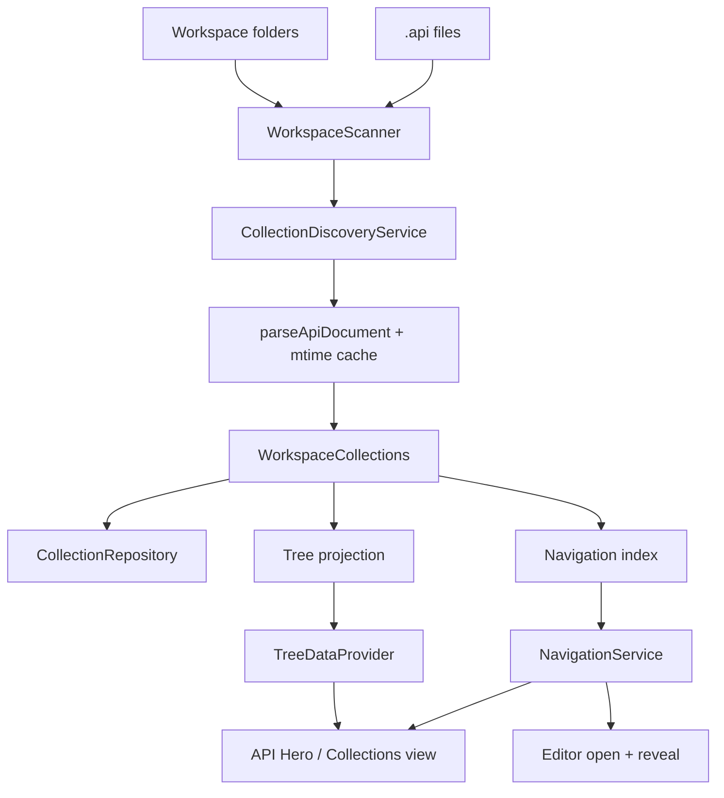

# Collections and workspace organization

Collections are the organizational model for API Runner `.api` files. This
subsystem provides discovery, an Activity Bar explorer, and editor ↔ tree
navigation. Sequential multi-request execution lives in the Collection Runner —
see [collection-runner.md](./collection-runner.md). Request History is a
separate subsystem — see [history.md](./history.md).

See [request-execution-pipeline.md](./request-execution-pipeline.md) for the
live single-request run path. Collections help users find and open requests;
Collection Runner executes ordered plans through the same orchestrator.

## Discovery model

One coherent rule (stable for this sprint):

1. Each VS Code **workspace folder** is one `WorkspaceRoot`.
2. Each workspace folder is currently **one `Collection`** rooted at that
   folder (1:1). Identity helpers and `ExtensionBag` leave room for future
   collection markers without breaking consumers.
3. Directories that contain `.api` files become `Folder` nodes. Intermediate
   parents are created so nested paths form a tree.
4. Each `.api` file is a **request source**, not a tree node. Parsed requests
   become `RequestReference` children of the containing folder (or the
   collection root when the file sits at the collection root).
5. Request labels and ranges come from the existing `parseApiDocument` entry
   point (via an mtime-keyed parse cache). Labels prefer `@name`, otherwise
   `METHOD url`.

Multi-root workspaces produce multiple workspace roots and collections.
Missing workspace, unreadable files, and parse failures become
`CollectionDiscoveryIssue` records; discovery never throws into the UI.

## Layering

| Layer | Location | Responsibility |
| --- | --- | --- |
| Domain models | `src/collections/models.ts` | Immutable `Collection`, `Folder`, `RequestReference`, metadata, extension bags |
| Scanner port | `src/collections/scanner.ts` | Workspace folders + `**/*.api` listing |
| Repository port | `src/collections/repository.ts` | Cached `WorkspaceCollections` snapshot |
| Discovery | `src/collections/discovery.ts` | Scan → parse → domain graph |
| Navigation index | `src/collections/navigation.ts` | `uri + offset → RequestReference` |
| Tree projection | `src/collections/tree-projection.ts` | Pure tree nodes (framework-free) |
| VS Code adapters | `src/collections/vscode/` | TreeDataProvider, filesystem scan, navigation, registration |

The domain barrel (`src/collections/index.ts`) must not import `vscode`.
`extension.ts` composes only through `registerCollections`.

## Lifecycle and caching

1. On activation, `registerCollections` constructs discovery, tree, and
   navigation, then calls `refresh()` once.
2. `refresh()` scans folders, reads each `.api` file, parses through
   `ApiFileParseCache` (keyed by path + mtime), and stores a deeply frozen
   aggregate in the repository.
3. Tree expand/collapse reads the cached aggregate only — it does **not**
   rescan the workspace.
4. Invalidation triggers a refresh when:
   - workspace folders change
   - `.api` files are created, deleted, renamed, or saved
5. Parse cache entries are dropped on file invalidate / full invalidate so
   edited files are reparsed.

### Known debt — concurrent refresh

`refresh()` is not yet serialized. Overlapping invalidate/refresh calls can
finish out of order (last-write-wins in the repository). Collection Runner
mitigates plan build by awaiting one refresh and freezing that aggregate into
the `RunPlan`; mid-run discovery updates do not mutate an in-flight plan.
Serializing discovery refresh (generation token / single-flight) remains a
follow-up — see Prompt 011 Critical finding.

## Tree and navigation

Display hierarchy:

`Workspace → Collection → Folders → Requests`

Commands:

- `apiRunner.refreshCollections` — full rediscovery
- `apiRunner.revealActiveRequest` — reveal cursor request in the tree
- `apiRunner.openCollectionRequest` — open `.api` and position at the request
- `apiRunner.focusCollections` — focus the Collections view
- `apiRunner.runCollection` / `runFolder` / `runSelectedRequests` — see
  [collection-runner.md](./collection-runner.md)

Selecting a request opens the file and moves the cursor to the request start.
While editing `.api` files, selection changes reveal the matching tree node
(debounced) without fighting explicit user navigation.

## Extension points (deferred)

`ExtensionBag` on collections, folders, and requests reserves opaque bags for:

- Ordering / drag-and-drop
- Collection-scoped variables
- Tags, favorites, history
- OpenAPI **export** (import is implemented — see
  [openapi-import.md](./openapi-import.md))
- Cloud sync and team sharing

OpenAPI 3.0/3.1 **import** is implemented via `apiRunner.importOpenApi`.
Run Collection is implemented — see [collection-runner.md](./collection-runner.md).
Do not scaffold competing unused modules for the remaining bags.

## Testing gap

Core domain, discovery, cache, navigation, and tree projection are covered by
`node:test` under `src/collections/*.test.ts` with an in-memory scanner/reader.
There is no extension-host test harness in this repository, so
`TreeDataProvider` / `TreeView.reveal` behavior is validated only through the
pure projection layer and manual smoke testing — the same gap as prior VS Code
adapter prompts.

## Public APIs

Framework-free exports from `src/collections`:

- Models and identity helpers
- `CollectionDiscoveryService`, `InMemoryCollectionRepository`
- `ApiFileParseCache`, `parseApiFileRequests`
- `buildNavigationIndex`, `findRequestAtOffset`, `findRequestById`
- `getTreeRoots`, `getTreeChildren`, `treePathToRequest`, …

VS Code-only exports from `src/collections/vscode`:

- `registerCollections`
- `CollectionTreeDataProvider`, `CollectionNavigationService`
- `VsCodeWorkspaceScanner`, `VsCodeApiFileReader`
