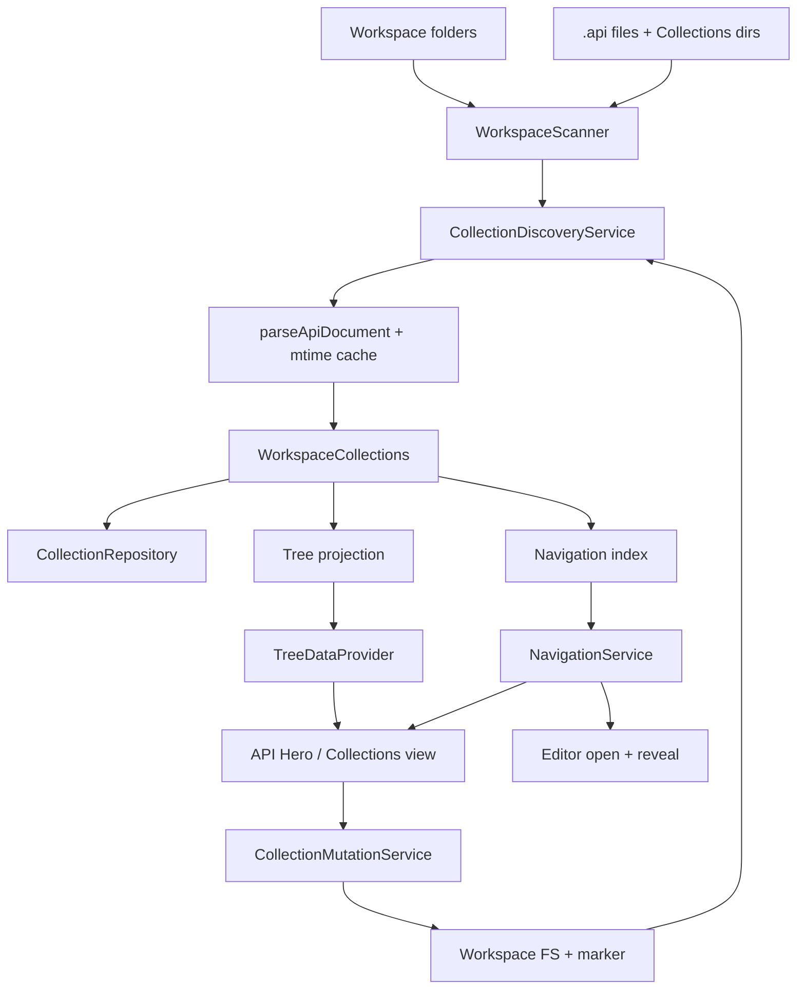

# Collections and workspace organization

Collections are the organizational model for API Hero `.api` files. This
subsystem provides discovery, an Activity Bar explorer, and editor ↔ tree
navigation. Sequential multi-request execution lives in the Collection Runner —
see [collection-runner.md](./collection-runner.md). Request History is a
separate subsystem — see [history.md](./history.md).

See [request-execution-pipeline.md](./request-execution-pipeline.md) for the
live single-request run path. Collections help users find and open requests;
Collection Runner executes ordered plans through the same orchestrator.

## Discovery model

One coherent rule (Phase 1a — read-only discovery; Phase 1b adds mutation):

1. Each VS Code **workspace folder** is one `WorkspaceRoot`.
2. Each immediate subdirectory of `Collections/` is a **native** `Collection`
   rooted at `Collections/<CollectionName>/`. Identity is
   `collectionIdForRoot(<absolute collection path>)`.
3. Optional marker file `api-hero.collection.json` at the collection root may
   supply `name`, `description`, numeric collection `order`, plus sibling
   order maps:
   - `folderOrder` — root array or map of parent relative path → folder names
     (`.` = collection root). Empty folders listed here appear in the tree.
   - `requestOrder` — map of parent relative path → `.api` basenames.
   Unlisted siblings fall back to locale path / name sort. A directory under
   `Collections/` is still a collection when the marker is missing (mutation
   creates the marker on first UI write).
4. `.api` files **not** under any native collection root join one **Legacy**
   synthetic collection per workspace folder (omitted when there are none).
   Legacy uses `legacyCollectionIdForWorkspace(workspaceRootPath)` — distinct
   from `collectionIdForRoot(workspaceRootPath)` — with `rootPath` equal to the
   workspace folder for relative-path math.
5. Directories that contain `.api` files become `Folder` nodes under the owning
   collection. Intermediate parents are created so nested paths form a tree.
   Marker `folderOrder` can also materialize empty folders.
6. Each `.api` file is a **request source**, not a tree node. Parsed requests
   become `RequestReference` children of the containing folder (or the
   collection root when the file sits at the collection root).
7. Request labels and ranges come from the existing `parseApiDocument` entry
   point (via an mtime-keyed parse cache). Labels prefer `@name`, otherwise
   `METHOD url`.

### Path-key / identity notes

| Helper | Key material | Stability |
| --- | --- | --- |
| `requestIdFor(filePath, index)` | Absolute file path/URI + request index | Unchanged — moves still change the id when the path changes |
| `collectionIdForRoot(rootPath)` | Absolute native collection directory | New for `Collections/<Name>/` roots |
| `legacyCollectionIdForWorkspace(ws)` | `collection:legacy:<normalized ws>` | New — do not confuse with `collectionIdForRoot(ws)` |
| `folderIdFor(collectionId, relativePath)` | Collection id + path relative to **collection** root | Relative paths for native collections no longer include the `Collections/<Name>/` prefix |

Multi-root workspaces produce multiple workspace roots; each may have native
collections and at most one Legacy. Missing workspace, unreadable files, and
parse failures become `CollectionDiscoveryIssue` records; discovery never
throws into the UI.

## Layering

| Layer | Location | Responsibility |
| --- | --- | --- |
| Layout constants | `src/collections/constants.ts` | `Collections/`, marker filename, Legacy label |
| Domain models | `src/collections/models.ts` | Immutable `Collection`, `Folder`, `RequestReference`, metadata, extension bags |
| Marker | `src/collections/marker.ts` | Parse/serialize `api-hero.collection.json` + order helpers |
| Scanner port | `src/collections/scanner.ts` | Workspace folders + collection roots + `**/*.api` listing |
| Repository port | `src/collections/repository.ts` | Cached `WorkspaceCollections` snapshot |
| Discovery | `src/collections/discovery.ts` | Scan → parse → domain graph (read-only) |
| Mutation | `src/collections/mutation/` | Filesystem CRUD ports + path helpers (no `vscode`) |
| Transfer | `src/collections/transfer/` | Export/import name collision helpers (no `vscode`) |
| Navigation index | `src/collections/navigation.ts` | `uri + offset → RequestReference` |
| Tree projection | `src/collections/tree-projection.ts` | Pure tree nodes (framework-free) |
| VS Code adapters | `src/collections/vscode/` | TreeDataProvider, DnD, mutation commands, filesystem scan |

The domain barrel (`src/collections/index.ts`) must not import `vscode`.
`extension.ts` composes only through `registerCollections`.

## Lifecycle and caching

1. On activation, `registerCollections` constructs discovery, tree, and
   navigation, then calls `refresh()` once.
2. `refresh()` scans folders, lists `Collections/*` roots, reads each `.api`
   file, parses through `ApiFileParseCache` (keyed by path + mtime), and stores
   a deeply frozen aggregate in the repository.
3. Tree expand/collapse reads the cached aggregate only — it does **not**
   rescan the workspace.
4. Invalidation triggers a refresh when:
   - workspace folders change
   - `.api` files are created, deleted, renamed, or saved
   - `api-hero.collection.json` markers are created, changed, or deleted
5. Parse cache entries are dropped on file invalidate / full invalidate so
   edited files are reparsed.
6. Concurrent `refresh()` / `invalidate*` calls are **single-flight** with a
   trailing re-run: overlapping callers share one in-flight scan, and a scan
   requested while another is running triggers one additional pass so the
   repository does not keep a stale last-write-wins snapshot.

## Tree and navigation

Display hierarchy (Phase 1a):

`Collection → Folders → Requests`

Collections (native + Legacy) are **sidebar roots**. Workspace folder nodes are
not shown; multi-root workspaces qualify collection descriptions with the
workspace folder name.

Empty state (`viewsWelcome`) offers Create Collection, Import OpenAPI, and Open
Existing Workspace.

Commands:

- `apiRunner.refreshCollections` — full rediscovery
- `apiRunner.revealActiveRequest` — reveal cursor request in the tree
- `apiRunner.openCollectionRequest` — open `.api` and position at the request
- `apiRunner.focusCollections` — focus the Collections view
- `apiRunner.createCollection` / `renameCollection` / `deleteCollection` /
  `duplicateCollection` — native collection CRUD (`Collections/<Name>/` + marker)
- `apiRunner.exportCollection` — copy a native collection folder (with marker)
  to a user-chosen destination directory
- `apiRunner.importCollection` — import a collection folder into
  `Collections/<Name>/`, ensure marker, refresh discovery (Rename / Overwrite
  on name collision)
- `apiRunner.createFolder` / `renameFolder` / `deleteFolder` / `duplicateFolder`
- `apiRunner.createRequest` / `renameRequest` / `duplicateRequest` /
  `deleteRequest` / `moveRequest` — one `.api` file per UI-created request.
  **New Request** opens a webview dialog (name, method, URL, description,
  collection, folder); content is written via
  `serializeRequestDocument` — see [request-source.md](./request-source.md).
- `apiRunner.openWorkspace` — wraps `vscode.openFolder`
- `apiRunner.runCollection` / `runFolder` / `runSelectedRequests` — see
  [collection-runner.md](./collection-runner.md)

Create content mutations always target native `Collections/` trees. Legacy is
read/organize for existing files; drag-and-drop (or Move Request) can relocate
a Legacy `.api` into a native collection. Collection reorder updates numeric
`order` on each marker; folder/request DnD updates `folderOrder` /
`requestOrder` name arrays.

Selecting a request opens the file and moves the cursor to the request start.
While editing `.api` files, selection changes reveal the matching tree node
(debounced) without fighting explicit user navigation.

## Extension points (deferred)

`ExtensionBag` on collections, folders, and requests reserves opaque bags for:

- Collection-scoped variables
- Tags, favorites, history
- OpenAPI **export** (import is implemented — see
  [openapi-import.md](./openapi-import.md); collection folder export/import is
  implemented via `exportCollection` / `importCollection`)
- Cloud sync and team sharing

Sibling ordering / drag-and-drop is implemented via the collection marker
(`order`, `folderOrder`, `requestOrder`) in Phase 1b — not via extension bags.

OpenAPI 3.0/3.1 **import** is implemented via `apiRunner.importOpenApi`.
Run Collection is implemented — see [collection-runner.md](./collection-runner.md).
Do not scaffold competing unused modules for the remaining bags.

## Testing gap

Core domain, discovery, cache, navigation, and tree projection are covered by
`node:test` under `src/collections/*.test.ts` with an in-memory scanner/reader.
There is no extension-host test harness in this repository, so
`TreeDataProvider` / `TreeView.reveal` behavior is validated only through the
pure projection layer and manual smoke testing — the same gap as prior VS Code
adapter prompts.

## Public APIs

Framework-free exports from `src/collections`:

- Layout constants (`COLLECTIONS_DIRECTORY_NAME`, `COLLECTION_MARKER_FILENAME`, …)
- Models and identity helpers (`collectionIdForRoot`,
  `legacyCollectionIdForWorkspace`, `requestIdFor`, …)
- Marker helpers (`parseCollectionMarker`, `serializeCollectionMarker`, …)
- Transfer helpers (`resolveCollectionNameCollision`,
  `preferredCollectionDirectoryName`, `looksLikeCollectionRoot`, …)
- `CollectionDiscoveryService`, `InMemoryCollectionRepository`
- `CollectionMutationService` + path helpers (including `exportCollection` /
  `importCollection`)
- `ApiFileParseCache`, `parseApiFileRequests`
- `buildNavigationIndex`, `findRequestAtOffset`, `findRequestById`
- `getTreeRoots`, `getTreeChildren`, `treePathToRequest`, …

VS Code-only exports from `src/collections/vscode`:

- `registerCollections`
- `CollectionTreeDataProvider`, `CollectionNavigationService`
- `CollectionTreeDragAndDropController`, `VsCodeCollectionFilesystem`
- `VsCodeWorkspaceScanner`, `VsCodeApiFileReader`
