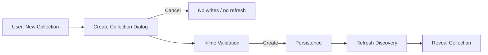

# CRUD prompt dialogs (webview)

Collection create/rename and related flows use API Hero webview panels instead
of `vscode.window.showInputBox` / `showQuickPick`.

## Create Collection (primary prompt-first example)

**Create Collection** is the canonical prompt-first create flow. It does **not**
use Explorer-style allocate-then-rename or a temporary `New Collection` folder.

| Aspect | Behavior |
| --- | --- |
| Dialog fields | **Name** (required), **Description** (optional) |
| Validation | Empty name, invalid filesystem characters, and reserved names are checked in the dialog; duplicate name and path collisions surface as in-dialog errors on **Create** (nothing is kept on failure) |
| Persistence | Only after the user clicks **Create** (project store if needed, folder, marker metadata) |
| Cancel | Resolves `undefined`; no filesystem writes, no project-store writes, no temporary collection, no tree refresh |
| After Create | Refresh discovery, reveal the collection, success feedback |

Rationale: prevents unnecessary filesystem writes, Cancel has no side effects,
validation runs before the collection is kept, and the UX matches modern create
dialogs. Architecture summary: [collections.md](./collections.md#create-collection-workflow).

Multi-root workspaces may prompt for a workspace folder before the dialog
opens. That selection does not write anything until **Create**.

## Rename flows (same dialog host, separate from create)

**Rename Collection**, **Rename Folder**, and **Rename Request** reuse the same
CRUD prompt webview host (`openCrudPromptDialog`) after the target already
exists. Rename is an explicit post-create action (for example **F2** or context
menu **Rename**). It is not part of Create Collection and must not be described
as “create then rename” / allocate-then-rename.

## Create Folder (distinct pattern)

**Create Folder** still uses Explorer-style **allocate-then-rename**: the
extension allocates a folder on disk, then opens the rename dialog so the user
can name it in place. Cancel keeps the allocated default-named folder. That
path is intentional and folder-only. Do not conflate it with Create
Collection’s prompt-first dialog.

## Layers

| Piece | Role |
| --- | --- |
| `crud-prompt-dialog-html.ts` | Pure HTML/CSS/JS + message parse/validate (no `vscode`) |
| `crud-prompt-dialog.ts` | WebviewPanel host; resolves submitted name (and optional description) or `undefined` on cancel |
| `destination-picker-dialog-html.ts` | Collection + folder selects; allowlists destinations |
| `destination-picker-dialog.ts` | WebviewPanel host for Move Request |
| `new-request-dialog*.ts` | Existing multi-field create-request dialog (same host pattern) |

Commands in `register-mutation-commands.ts` call these hosts. Domain mutation
code stays free of `vscode`.

## Accessibility

- Tab moves through fields and Cancel / primary actions
- Enter submits the form
- Escape posts `cancel` and closes the panel
- Validation errors stay in-dialog; submit re-enables after failure

## Intentionally not migrated

Filters, environment/auth session switchers, secret password prompts, file
pickers, and runner policy QuickPicks remain on VS Code APIs — see
[consistency-audit.md](../ux/consistency-audit.md).
