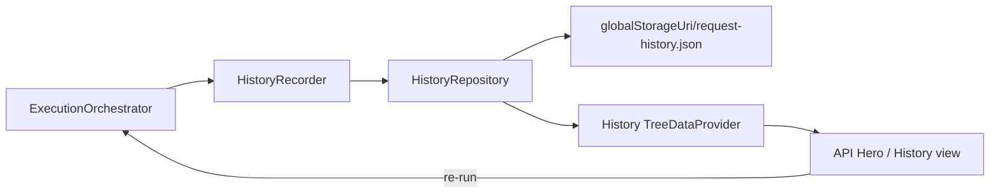

# Request History

Request History records finished single-request executions for local browse,
search, and re-run. It does **not** implement response diff, cloud sync,
analytics, AI, or collection-run dashboards.

See [request-execution-pipeline.md](./request-execution-pipeline.md) for the
live run path. History is a downstream observer of that path.

## Capture policy

`ExecutionOrchestrator` calls a `HistoryRecorder` **after**
`RequestExecutor.execute` returns, and only when the run is still current
(replacement / stale-run guards apply).

| Outcome | Recorded? |
| --- | --- |
| HTTP success (`ExecutionResult.success === true`) | Yes |
| Transport / execution failure | Yes |
| Cancelled at transport (`CANCELLED`) | Yes |
| Precondition failure before `execute` (parse, select, validate, build, variables, auth) | **No** (skipped) |
| Cancelled before `execute` | **No** (skipped) |
| Replaced / stale run | **No** (ignored by recorder + orchestrator) |

Viewer failures after a completed execution still leave the history entry
already committed from the execution result.

### Capture context ownership

Secret-free labels (`environmentName`, optional `collectionName`) are supplied
by one composition-owned provider: `registerHistory(...).getCaptureContext`,
wired into `ExecutionOrchestrator` from `extension.ts`. Do not duplicate an
inline provider in `activate`. Single-request runs typically omit
`collectionName`. Collection Runner merges that provider result with
`collectionName` from the run plan so history entries from collection runs
are labeled without inventing a separate Collections↔History service.

## Security

Persisted entries are **metadata-only**:

- URL is the sanitized `presentationUrl`, with additional userinfo redaction
- Never store `Authorization`, cookies, tokens, passwords, or secret values
- Never store raw `AuthenticatedRequest` / `RuntimeResponse` bodies by default
- Response metadata may include status, size, and content-type only
- Error messages are sanitized before persistence

`HistoryExtensionBag` reserves opaque bags (`bodyPersistence`, `sync`,
`analytics`) for future optional features. Default capture does not populate
them.

## Domain model

| Type | Role |
| --- | --- |
| `HistoryEntry` | Immutable recorded run |
| `ExecutionSummary` | Method, sanitized URL, status, duration, timestamp, outcome |
| `HistoryMetadata` | Request / environment / collection names, response size, source location |
| `HistoryExecutionStatus` | `success` \| `failure` \| `cancelled` |
| `HistoryStatistics` | Aggregate counts |
| `HistorySourceLocation` | Best-effort URI + line/character for reveal / re-run |

## Layering

| Layer | Location | Responsibility |
| --- | --- | --- |
| Domain models | `src/history/models.ts` | Immutable entry shapes |
| Sanitize | `src/history/sanitize.ts` | URL / error redaction |
| Repository port | `src/history/repository.ts` | Append / list / delete / clear / retention |
| Recorder | `src/history/recorder.ts` | Build + append; ignore stale runs |
| Query | `src/history/query.ts` | Filter, sort, group, statistics |
| Re-run | `src/history/rerun.ts` | Pure argument resolution |
| VS Code adapters | `src/history/vscode/` | File persistence, TreeDataProvider, commands |

The domain barrel (`src/history/index.ts`) must not import `vscode`.
`extension.ts` composes through `createHistoryInfrastructure` +
`registerHistory`.

## Persistence

- **Location:** `{globalStorageUri}/request-history.json`
- **Envelope:** `{ schemaVersion: 1, entries: HistoryEntry[] }`
- **Retention:** `apiRunner.history.maxEntries` (default **1000**); newest kept
- **Migration:** unknown `schemaVersion` values reset to an empty v1 document
  rather than risking secret leakage from an unknown shape
- Hot path keeps an in-memory cache of lightweight summaries only; bodies are
  never loaded because they are never stored

## Explorer UI

Activity Bar view `apiRunner.history` groups entries:

`Today` / `Yesterday` / `Last 7 Days` / `Older`

Commands:

- Open History Entry
- Re-run History Entry
- Reveal Original Request
- Delete Entry / Clear History
- Search (filter) / Refresh

## Re-run

Re-run opens the stored source URI, positions the editor, and calls the same
`ExecutionOrchestrator.runAtPosition` path. It does **not** bypass variables
or authentication. Missing files produce a friendly error.

## Extension points (deferred)

- Optional body persistence via `HistoryExtensionBag.bodyPersistence`
- Cloud sync / team sharing
- Response diff between history entries
- Analytics / AI summaries
- Collection run dashboards (History still records each request from
  Collection Runner via the orchestrator — see
  [collection-runner.md](./collection-runner.md))

## Explicit exclusions

Do not reintroduce deleted `src/services/history-service` scaffolding.
Do not store large response bodies by default.
Do not implement diff, sync, cloud history, or analytics/AI in this subsystem.
