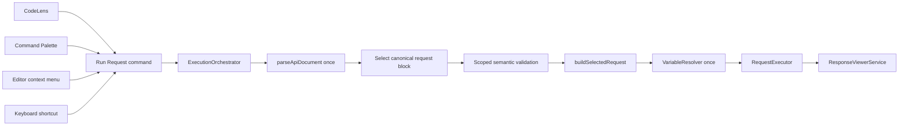
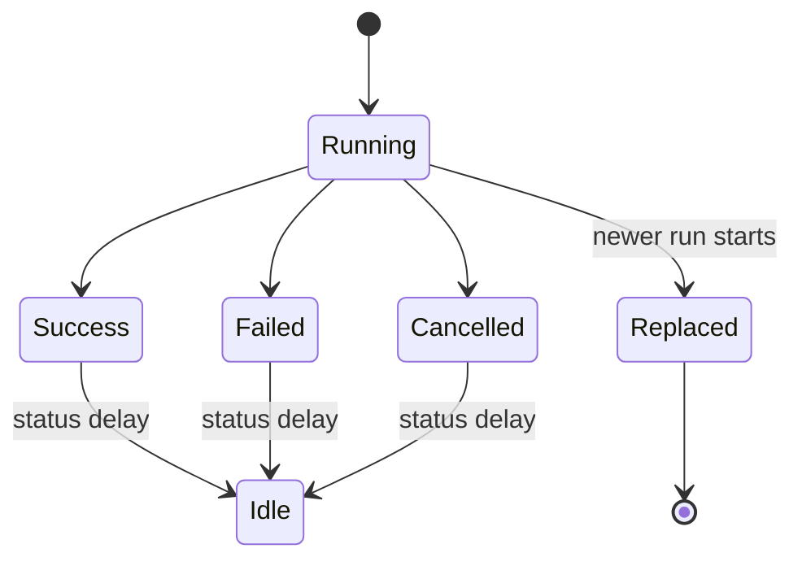

# Request execution pipeline

The live pipeline includes explicit additive stage contracts:

`RuntimeRequest -> ResolvedRequest -> AuthenticatedRequest -> RequestExecutor`

Variable resolution creates `ResolvedRequest`. The provider-based
authentication resolver then decorates an immutable copy and creates
`AuthenticatedRequest`; only that final stage is accepted by the executor.
See [Authentication](authentication.md).

## End-to-end flow

All single-request entry points converge on `apiRunner.runRequest`:

The command is a VS Code adapter only. It validates a serializable CodeLens
location or falls back to the active cursor, checks that the active document
uses the `api` language, and passes a text snapshot, source URI, and offset to
the orchestrator. It contains no parsing, selection, validation, building,
execution, or presentation logic.

## Responsibilities and boundaries

- `src/parser` owns the canonical `ApiDocument`, parser diagnostics, semantic
  rules, and request-block boundary metadata.
- `src/orchestration/index.ts` is the framework-neutral public entry point. It
  exports the orchestrator, request selection, errors, and neutral contracts
  without loading VS Code.
- `src/orchestration/vscode/index.ts` is the VS Code-specific adapter entry
  point for progress, status, and notification implementations. Extension
  composition imports these adapters explicitly from `./orchestration/vscode`.
- `src/orchestration/request-selection.ts` selects one `RequestNode` using
  canonical request ranges, `requestBlock` metadata, and parser-recorded
  separator ranges. It does not inspect source text or use regular expressions.
- `validateApiRequest` runs the existing semantic rules and retains diagnostics
  affecting the selected request or document directives required by runtime
  construction. An invalid unrelated request does not block the selection.
- `buildSelectedRequest` projects only the selected canonical node. It preserves
  the source-order request ID and document directives without building sibling
  requests.
- `VariableResolver` consumes an immutable environment/configuration snapshot,
  produces a new deeply frozen request, and blocks execution on relevant
  unresolved references. See [variables.md](variables.md).
- `src/execution` receives only `RuntimeRequest`; parser and AST types never
  cross the execution boundary, and the executor never resolves variables.
- `ResponseViewerService` receives only `ExecutionResult` and reuses its one
  panel.
- VS Code progress, status, notifications, CodeLens, command, and webview-panel
  implementations remain narrow adapters.

The parser records request separator ranges in additive document metadata.
This is necessary to distinguish whitespace/comments in a request block from
the separator itself and from an empty block at EOF. Parsing behavior and
transport behavior are otherwise unchanged.

## Parse-once and request selection

Each run parses the command's immutable text snapshot exactly once. Downstream
steps receive that same `ApiDocument`; no service reparses it.

A separator divides the document into half-open request blocks. The separator
range belongs to neither adjacent block. A position in a block selects its one
request, including positions on request directives, headers, body, comments,
interstitial whitespace, and EOF in the final non-empty block. Selection fails
when the position is outside the document, on a separator, in an empty block,
or in a block with zero or multiple declarations. Malformed or inconsistent
canonical ranges also fail closed.

Parser errors gate execution only when their ranges intersect the selected
block. Semantic errors gate the selected request and required document-level
directives. Warnings remain non-blocking.

The existing parser-to-validator diagnostic relocation remains intentional:
when a parser `parser.unexpected-token` diagnostic represents a likely URL
without an HTTP method, the request validation rule derives the user-facing
`validation.missing-method` semantic diagnostic. The original syntax diagnostic
remains parser-owned on `ParserResult`; semantic classification is owned by the
validator and scoped by `validateApiRequest`.

## Orchestration, concurrency, and cancellation

`ExecutionOrchestrator.runAtPosition` owns one active workflow:

Concurrency uses replacement. Starting a newer run aborts the previous run's
`AbortController`. Every completion checks its monotonically increasing run
identity before touching the viewer, status, or notifications, so a stale
executor cannot overwrite newer state even if its transport ignores abort.

`window.withProgress` is cancellable. Its cancellation token aborts the same
workflow controller passed to `RequestExecutor` through `ExecutionContext`.
Listeners are removed in `finally`; executor-owned timeout and abort resources
are also cleaned up by the execution layer. Disposing the orchestrator aborts
the active workflow and disposes status UI.

## Viewer and status lifecycle

Operational results, including structured network errors and explicit
cancellation results returned by the executor, are sent to
`ResponseViewerService.show`. The service updates its existing panel before
revealing it and creates a panel only when none exists.

The status adapter owns one item and one idle timer. It displays theme-icon
states for Running, Success with status code, Failed, and Cancelled. A new state
cancels the previous timer; terminal states deterministically return to hidden
idle. Viewer failures are caught, reported with a safe notification, and do not
skip orchestration cleanup.

## Error handling

Selection, selected parser diagnostics, scoped semantic diagnostics, and build
failures are orchestration/precondition failures. They do not open the viewer
and produce concise notifications without stack traces. Executor operational
failures are structured `ExecutionResult` values and do open the viewer.
Unexpected thrown values receive a fixed safe message.

## Testing strategy

Framework-neutral tests cover block selection, separators, comments, nested
body structures, directives, boundaries, EOF, empty/ambiguous/malformed
blocks, scoped validation, selected building, orchestration success/failure,
cancellation, replacement, stale completion, viewer failure, disposal,
CodeLens descriptors, command argument validation, and manifest convergence.
Executor boundaries are faked; no test uses an external network.

The repository deliberately uses `node:test`. Vitest was not added because
introducing a second runner would duplicate the established infrastructure.
There is no existing VS Code extension-host test setup, so VS Code APIs are
kept behind adapters and the deterministic controller/core behavior is tested
without an extension host. A Node test imports `src/orchestration/index.ts`
directly; because the VS Code runtime is unavailable in that test process, the
successful import demonstrates that the neutral barrel does not resolve the
VS Code adapter module.

## Future extension points

The pipeline can accept additional `RequestExecutor`, progress, status,
notification, or viewer adapters without changing parser/runtime contracts.
Future resolution stages may be inserted between selected building and
execution only through explicit runtime-domain contracts.

## Explicit exclusions

Run File remains a separate placeholder. Organization of `.api` files lives in
the Collections explorer ([collections.md](./collections.md)). Sequential
Collection Runner reuses this pipeline through
`ExecutionOrchestrator.runAtSourceLocation` with viewer suppression — see
[collection-runner.md](./collection-runner.md). Deferred product work (OpenAPI
export / Swagger 2.0, GraphQL, WebSocket, gRPC, OAuth, streaming transport,
secret lifecycle cleanup, AI) is listed in [execution.md](./execution.md) and
must not be partially reintroduced as unused service scaffolding. OpenAPI 3
import is implemented — see [openapi-import.md](./openapi-import.md). Variables,
authentication, the response viewer, and request history are already on (or
observing) the live orchestration path. See [history.md](./history.md).
