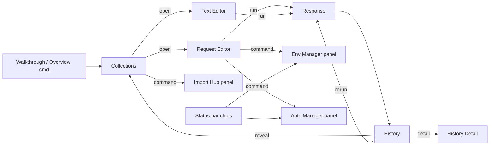

# API Hero — Information Architecture

**Version:** 1.2 (Final Polish)  
**Goal:** Navigation structure for a UI-first API Hero that follows **VS Code conventions**.  
**Status key:** ✅ Exists · 🔶 Partial · 🆕 Planned

---

## IA law (non-negotiable)

```text
Activity Bar → API Hero
  ├── Collections     ✅  (only permanent organizational view)
  └── History         ✅  (only permanent temporal view)
```

Everything else opens as:

| Kind | Examples |
| --- | --- |
| **Editors** | Request Editor, Text `.api` |
| **Panels** | Response, History Detail, Env Manager, Auth Manager, Import Hub, Run Report, Overview |
| **Dialogs / pickers** | New Request, InputBox, QuickPick, confirms, OpenDialog |
| **Settings** | `apiRunner.*` |
| **Workbench** | Problems, Output, Walkthrough |

**Do not** add permanent Activity Bar views for Dashboard, Environments, Variables, or Auth Profiles. That pattern fights VS Code density and [`product-experience.md`](./product-experience.md) (“Minimal”, “Native”).

Managers are reached via **Collections overflow menu**, **Request Editor toolbar links**, **Overview quick actions**, **status bar chips**, and **welcome/walkthrough actions** — not Command Palette as the primary path.

---

## 1. Top-level map

```text
API Hero
├── Collections                        ✅  ← Activity Bar
│   ├── Collection                     ✅
│   │   ├── Folder                     ✅
│   │   │   ├── Folder…                ✅
│   │   │   └── Request                ✅
│   │   └── Request                    ✅
│   └── Legacy Collection              🔶
├── History                            ✅  ← Activity Bar
│   ├── Time groups                    ✅
│   ├── Entry                          ✅
│   └── Entry detail                   🔶 → panel 🆕
├── Editors
│   ├── Request Editor                 ✅  (top: method/URL/Run/Env/Auth)
│   └── Text Editor (.api)             ✅
├── Panels (command-opened)
│   ├── Response                       ✅
│   ├── History Detail                 ✅
│   ├── Environments Manager           ✅
│   ├── Variables (tab in Env Manager) ✅
│   ├── Auth Profiles Manager          ✅
│   ├── Import Hub                     ✅
│   ├── Collection Run Report          ✅
│   └── Overview (optional orientation)✅
├── Dialogs / Pickers                  ✅/🆕
├── Settings (apiRunner.*)             ✅
└── Walkthrough / Welcome              🔶 → 🆕
```

---

## 2. Activity Bar (only)

```text
Activity Bar
└── API Hero (container: apiRunner)     ✅
    ├── Collections                     ✅  tree
    └── History                         ✅  tree
```

| Rule | Detail |
| --- | --- |
| One product icon | No second Activity Bar entry |
| Two views max | Collections + History |
| Reserved `apiRunner.explorer` | Do **not** revive |
| Collapse-all | Allowed on both trees |

---

## 3. Sidebar views (detail)

### 3.1 Collections ✅

```text
Collections
├── [View title toolbar]
│   ├── Icons: New Request | New Collection | Import OpenAPI
│   └── Overflow: Manage Environments | Manage Authentication | Settings
│                 | Recent Requests | Overview | Import Collection
│                 | Filter | Refresh | Reveal Active Request
├── Welcome (empty) → New Request | New Collection | Import OpenAPI
│                     | Manage Env/Auth | Overview | Open Workspace
└── Tree
    └── Collection → Folder… → Request
         └── open → Request Editor (single) | Text (multi)
```

**Components:** CollectionTree, FolderNode, RequestNode, MethodBadge, EmptyState — [`component-library.md`](./component-library.md).  
**Screen:** S01, S02 — [`screen-list.md`](./screen-list.md).

### 3.2 History ✅

```text
History
├── [Toolbar] Icons: Filter | Refresh
│             Overflow: Clear | Focus Collections | Overview
├── Welcome → “No recent requests yet” | Focus Collections | Overview | New Request | Refresh
└── Tree → time groups → entries
         └── Open → History Detail panel
```

**Components:** HistoryCard, SearchInput, EmptyState.  
**Screens:** S03, S04, S30.

---

## 4. Editors

```text
Editors
├── Request Editor (apiRunner.requestEditor)
│   └── Tabs: Request | Headers | Params | Body | Auth | Variables | Tests | Settings | Preview
│   └── Top bar: Method | URL | Environment | Authentication | Run
│   └── Secondary: Open Text; Auth tab → Manage Authentication; Variables → Manage Environments
└── Text Editor (language api)
    └── CodeLens / editor title: Run ($(play)); overflow: Open Request Editor, Switch Env, Select Auth
```

**IA rule:** One document ↔ one primary surface. Text ↔ form is intentional, synced, same buffer.

**Thin shortcuts (not Activity Bar views):** `apiRunner.openSettings` → VS Code Settings filtered to the extension; `apiRunner.recentRequests` → focuses History.

**Screens:** S06–S08.

---

## 5. Panels (not Activity Bar)

| Panel | Opened by | Role | Screen |
| --- | --- | --- | --- |
| Response | Run (single) | Inspect result | S09 |
| History Detail | History open | Past run metadata | S30 |
| Environments Manager | Command / chip / editor link | Env + vars CRUD | S25–S26 |
| Auth Profiles Manager | Command / chip / Auth tab | Profile + secrets UX | S27–S28 |
| Import Hub | Command / welcome | OpenAPI + future importers | S29 |
| Collection Run Report | End of multi-run | Tabular results | S31 |
| Overview | Command / walkthrough / Collections overflow | Landing: Recent Requests (list), Recent Activity (compact last-run summary + Open History), Recent Collections, Quick Actions, Tips | S24 |

**Overview** is optional and **must not** become a third Activity Bar view.

---

## 6. Dialogs & pickers

```text
Dialogs / Pickers
├── InputBox — names                              ✅
├── QuickPick — env, auth, move, failure policy   ✅
├── Confirm — delete, clear history               ✅
├── OpenDialog / WorkspaceFolderPick              ✅
├── New Request webview                           ✅
├── Collision Rename/Overwrite                    ✅
└── Secret set prompt                             🆕
```

Preference: **picker > dialog > wizard** ([`interaction-model.md`](./interaction-model.md)).

---

## 7. Settings

```text
VS Code Settings → API Hero (apiRunner.*)
```

Managers write the **same** keys. No second configuration store ([`technical-constraints.md`](./technical-constraints.md)).

---

## 8. Response structure

```text
Response Panel
├── Hero: StatusBadge · MethodBadge · URL
├── Stats: DurationBadge · sizes · content-type · …
├── Toolbar: Copy | Save | Search 🆕
├── Body: ResponseTabs (Pretty | Raw) + JSONViewer
├── Headers
├── Cookies (only if implemented)
└── Assertions
```

---

## 9. Cross-links



---

## 10. Concern → surface matrix

| Concern | Primary | Fallback |
| --- | --- | --- |
| Organize requests | Collections | Explorer |
| Edit request | Request Editor | Text |
| Inspect last run | Response | History Detail |
| Browse past runs | History | — |
| Env / vars | Env Manager **panel** | Settings |
| Auth | Auth Manager **panel** | Settings + `@auth` |
| Orient | Welcome + Walkthrough + Overview **command** | README |
| Rare knobs | Settings | settings.json |

---

## 11. Naming (stable ids)

| UI label | Id |
| --- | --- |
| API Hero container | `apiRunner` |
| Collections | `apiRunner.collections` |
| History | `apiRunner.history` |
| Request Editor | `apiRunner.requestEditor` |
| Response | `apiRunner.response` |

New **panels** use `apiRunner.<feature>` webview types — **not** new Activity Bar views.

---

## 12. Explicitly forbidden IA

- Permanent Environments / Auth / Variables / Dashboard Activity Bar views  
- Second Activity Bar icon for “managers”  
- Mini-SPA replacing Collections tree  
- Cloud-only top-level nav  
- Per-protocol top-level before engines exist  

---

## 13. Command catalog (managers & orientation)

These commands open **panels / pickers**, never new Activity Bar views:

| Command (user title) | Opens | Screen |
| --- | --- | --- |
| Manage Environments | Env Manager panel | S25 |
| Manage Auth Profiles | Auth Manager panel | S27 |
| Switch Environment | QuickPick (+ persist) | S13 |
| Select Authentication | QuickPick | S14 |
| Import Hub / Import OpenAPI | Import Hub or OpenAPI flow | S29 / S18 |
| Open Overview | Overview panel | S24 |
| Focus Collections / History | Activity Bar views | S01 / S03 |

Status bar chips invoke the same commands.

---

## Related documents

- [`north-star.md`](./north-star.md)  
- [`screen-list.md`](./screen-list.md)  
- [`component-library.md`](./component-library.md)  
- [`product-experience.md`](./product-experience.md)  
- [`user-flows.md`](./user-flows.md)  
- [`interaction-model.md`](./interaction-model.md)  
