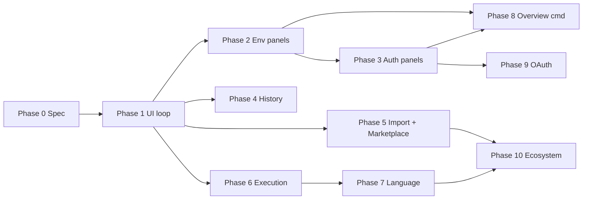

# API Hero — Product Roadmap

**Version:** 1.2 (Final Polish)  
**Strategy:** User value for UI-first workflows over engineering convenience.  
**v1.0 gate:** [`north-star.md`](./north-star.md) · [`marketplace-strategy.md`](./marketplace-strategy.md)  
**IA law:** Activity Bar stays **Collections + History only** ([`information-architecture.md`](./information-architecture.md)).  
**Complexity:** S · M · L · XL

Each phase uses the same template: Objectives · Deliverables · Screens · Dependencies · Risks · Success criteria · Exit criteria · Testing · Migration · Rollback · Developer notes.

---

## Phase summary

| Phase | Theme | Complexity | v1.0? | Primary screens |
| --- | --- | --- | --- | --- |
| 0 | Spec & alignment | S | Required | Docs |
| 1 | UI-first request loop | M | Required | S06, S09, S10, S08 |
| 2 | Env/vars managers | L | Required | S25, S26, S13 |
| 3 | Auth managers | L | Required | S27, S28, S14 |
| 4 | History & run reporting | M–L | Required | S30, S31, S12 |
| 5 | Import Hub & Marketplace | L–XL | Required | S29, S32, S34 |
| 6 | Execution fidelity | L | Strongly preferred | S06 Body, S09, Run File |
| 7 | Language assist | M–L | Optional trail | S08, S20 |
| 8 | Orientation & Legacy | M | Optional trail | S24, S33 |
| 9 | OAuth | XL | Post-1.0 OK | S27 |
| 10 | Ecosystem / CLI | XL | Post-1.0 | Import Hub providers |

---

## Phase 0 — Spec & alignment

| Field | Content |
| --- | --- |
| **Objectives** | Lock product definition so 0.5 → 1.0 needs no redesign |
| **Deliverables** | Full `docs/product/*` set (vision through north-star, design system, etc.) |
| **Screens** | N/A (docs only) |
| **Dependencies** | 0.5.x code + UX inventory |
| **Risks** | Spec drift if implementation ignores docs — mitigate via phase exit reviews |
| **Success criteria** | Spec review approved; IA law accepted |
| **Exit criteria** | All listed product docs present; contradictions resolved |
| **Testing requirements** | None |
| **Migration requirements** | None |
| **Rollback considerations** | Docs-only; revert commits |
| **Developer notes** | Do not start Phase 1 features until exit criteria met |
| **Complexity** | S |

---

## Phase 1 — UI-first request loop

| Field | Content |
| --- | --- |
| **Objectives** | Create → edit → run → inspect feels visual and native |
| **Deliverables** | Default Request Editor for single-request; New Request opens form; editor title Run; Response Copy/Save/Search; hide palette stubs or implement Run File later; status bar env chip (read-only OK if Phase 2 persists) |
| **Screens** | S06, S09, S10, S08 title menu; touches S01 open path |
| **Components** | Toolbar, ToolbarButton, ResponseTabs, JSONViewer, SearchInput |
| **Gaps** | G01, G07, G08 (partial), G11 |
| **Dependencies** | request-editor, navigation-service, response webview, `package.json` menus |
| **Risks** | Text-first users surprised by default editor — mitigate Open With Text + CHANGELOG |
| **Success criteria** | First run without text editing in usability check; copy body works |
| **Exit criteria** | G01+G07 closed; perf budgets for editor open + response ≤256KB ([`performance-goals.md`](./performance-goals.md)); no broken sync |
| **Testing requirements** | Navigation + request-editor + response HTML/unit tests; manual EDH create→run |
| **Migration requirements** | UX default change noted in CHANGELOG; files unchanged |
| **Rollback considerations** | Revert editor priority / open paths independently of response tools |
| **Developer notes** | Keep multi-request guard; secrets still never in webview; follow interaction-model confirm rules |
| **Complexity** | M |

---

## Phase 2 — Environments & variables managers

| Field | Content |
| --- | --- |
| **Objectives** | Visual env/var management; one honest active environment |
| **Deliverables** | Environments Manager **panel**; Variables as tabs; Switch Environment writes `activeEnvironment`; Request Editor EnvironmentPicker; status bar chip writable |
| **Screens** | S25, S26, S13 |
| **Components** | EnvironmentManager, KeyValueTable, EnvironmentPicker, SectionCard |
| **Gaps** | G02, G04 |
| **Dependencies** | settings provider, variables engine; Phase 1 toolbar patterns |
| **Risks** | Medium — session-only users need migration messaging |
| **Success criteria** | CRUD env without Settings JSON; active env survives reload |
| **Exit criteria** | G02+G04 closed; manager open ≤300 ms p95; settings round-trip tests green |
| **Testing requirements** | Settings write/read tests; webview message contract tests; no vscode in core |
| **Migration requirements** | On activate, session ← settings; document in CHANGELOG Migration |
| **Rollback considerations** | Feature-flag panel commands; keep QuickPick path |
| **Developer notes** | **Panel, not Activity Bar view**; same `apiRunner.environments` keys |
| **Complexity** | L |

---

## Phase 3 — Auth profiles & secrets UX

| Field | Content |
| --- | --- |
| **Objectives** | Guided auth without Settings JSON; safe secrets |
| **Deliverables** | Auth Profiles Manager **panel**; Set Secret prompt; missing-secret CTA/Code Action; Auth tab deep link; remove Login/Logout from palette until Phase 9 |
| **Screens** | S27, S28, S14 |
| **Components** | AuthProfileManager, AuthPicker, ConfirmationDialog |
| **Gaps** | G03, G05, G08 (auth stubs), G16 (auth actions) |
| **Dependencies** | SecretStorageService, auth module; Phase 2 patterns |
| **Risks** | Low if schema unchanged; High if secrets leak to webview — test protocol |
| **Success criteria** | Create bearer/API key + set secret entirely from UI |
| **Exit criteria** | G05 closed; zero secrets in webview fixtures; G03 policy documented |
| **Testing requirements** | Auth adapter tests; protocol allowlist review; manual secret flow |
| **Migration requirements** | Existing profiles valid |
| **Rollback considerations** | Hide manager command; Settings path remains |
| **Developer notes** | SecretStorageService only; panel not Activity Bar |
| **Complexity** | L |

---

## Phase 4 — History & run reporting

| Field | Content |
| --- | --- |
| **Objectives** | History detail worthy of a primary view; clearer collection outcomes |
| **Deliverables** | History Detail **panel**; facet filters; Collection Run Report panel; failure policy setting + ask-or-default |
| **Screens** | S30, S31, S12 |
| **Components** | HistoryCard, CollectionRunReport, SearchInput |
| **Gaps** | G06, G10 |
| **Dependencies** | history module, collection-runner UI |
| **Risks** | Low |
| **Success criteria** | Open history → structured panel; collection run → filterable report |
| **Exit criteria** | G06 closed; history load ≤200 ms for 1k entries |
| **Testing requirements** | History provider tests; webview tests; runner summary tests |
| **Migration requirements** | None (metadata format stable) |
| **Rollback considerations** | Fall back to information message if panel disabled |
| **Developer notes** | Still no body persistence by default |
| **Complexity** | M–L |

---

## Phase 5 — Import hub & Marketplace

| Field | Content |
| --- | --- |
| **Objectives** | Acquisition + listing completeness |
| **Deliverables** | Import Hub **panel**; Postman import; zip transfer; walkthrough; screenshots/banner; demo workspace |
| **Screens** | S29, S18, S32, S34 |
| **Components** | ImportHub, ProgressBanner, EmptyState |
| **Gaps** | G14, G15, G21, G22 |
| **Dependencies** | provider registry, transfer; Phases 1–3 for polished first-run |
| **Risks** | Postman mapping fidelity Medium |
| **Success criteria** | Postman → runnable Collections; Marketplace gate checklist green |
| **Exit criteria** | [`marketplace-strategy.md`](./marketplace-strategy.md) § v1.0 gate items for assets; OpenAPI 100-op perf target |
| **Testing requirements** | Golden Postman fixtures; import cancel/partial-write rules |
| **Migration requirements** | Imports only create native collections |
| **Rollback considerations** | Ship Hub with OpenAPI-only if Postman slips |
| **Developer notes** | Honest Marketplace copy if Postman delayed |
| **Complexity** | L–XL |

---

## Phase 6 — Execution fidelity

| Field | Content |
| --- | --- |
| **Objectives** | Real-world body/protocol gaps closed |
| **Deliverables** | Multipart + binary upload; Run File; basic cookie jar **or** hide cookies UI; redirect chain UI |
| **Screens** | S06 Body, S09, Run File command |
| **Components** | Body editors, Response sections |
| **Gaps** | G13, G18, G19 |
| **Dependencies** | execution transport, request-source, Phase 1 editor |
| **Risks** | Medium — serialize round-trip |
| **Success criteria** | File upload from Request Editor end-to-end; Run File works |
| **Exit criteria** | G18+G19 closed; round-trip tests for multipart; UI never freezes on large file (progress) |
| **Testing requirements** | Heavy executor + serialize suites |
| **Migration requirements** | Additive; old files parse |
| **Rollback considerations** | Feature-flag multipart; keep UNSUPPORTED path |
| **Developer notes** | No `fetch()` outside engine |
| **Complexity** | L |

---

## Phase 7 — Language & power-user assist

| Field | Content |
| --- | --- |
| **Objectives** | Faster text fixes; richer asserts |
| **Deliverables** | Code Actions; JSON Schema expects; `$uuid`/`$timestamp`; editor polish |
| **Screens** | S08, S20; Tests tab |
| **Components** | AssertionBuilder extensions |
| **Gaps** | G16, G17, G24 (partial) |
| **Dependencies** | language-support, assertions, parser additive |
| **Risks** | Low–Medium for new expect kinds |
| **Success criteria** | Common diagnostics offer one-click fixes |
| **Exit criteria** | Code Action tests; built-ins resolve in variable tests |
| **Testing requirements** | Language + assertion suites |
| **Migration requirements** | Additive grammar only |
| **Rollback considerations** | Disable providers via settings toggles |
| **Developer notes** | Single parser rule stands |
| **Complexity** | M–L |

---

## Phase 8 — Orientation & Legacy polish

| Field | Content |
| --- | --- |
| **Objectives** | Orient users **without** Activity Bar sprawl; reduce Legacy confusion |
| **Deliverables** | Overview **command/panel** (not a view); Legacy migration assistant; Collections search; welcome copy refresh |
| **Screens** | S24, S33; S01 search |
| **Components** | OverviewPanel, SearchInput |
| **Gaps** | G09, G21 (remainder), G25 |
| **Dependencies** | Phases 2–4 managers exist |
| **Risks** | Low; migration moves files — confirm heavily |
| **Success criteria** | Users find env/auth via Overview/commands; Legacy labeled + migratable |
| **Exit criteria** | Still exactly **2** Activity Bar views; migration dry-run + confirm |
| **Testing requirements** | Migration unit tests; search perf budget |
| **Migration requirements** | Optional Legacy → native; reversible via SCM |
| **Rollback considerations** | Overview is additive command |
| **Developer notes** | **Do not** promote Env/Auth to Activity Bar — contradicts IA law |
| **Complexity** | M |

---

## Phase 9 — Advanced auth (post–v1.0 OK)

| Field | Content |
| --- | --- |
| **Objectives** | Enterprise OAuth depth |
| **Deliverables** | OAuth2 providers; refresh; real Login/Logout |
| **Screens** | S27 extensions; Login/Logout commands |
| **Gaps** | G20 |
| **Dependencies** | Phase 3 manager; URI callbacks |
| **Risks** | Medium–High |
| **Success criteria** | OAuth API runnable without tokens in `.api` |
| **Exit criteria** | Security review; secret rotation documented |
| **Testing requirements** | Provider mocks; careful EDH |
| **Migration requirements** | New provider types in settings |
| **Rollback considerations** | Disable OAuth providers via settings |
| **Developer notes** | May ship after 1.0.0 |
| **Complexity** | XL |

---

## Phase 10 — Ecosystem (exploratory)

| Field | Content |
| --- | --- |
| **Objectives** | CI + broader interchange |
| **Deliverables** | CLI reusing core; OpenAPI export; Insomnia/Bruno import; JUnit report |
| **Screens** | Import Hub providers; external CLI |
| **Gaps** | G15 remainder, G24 remainder |
| **Dependencies** | vscode-free core barrels |
| **Risks** | Low if additive package |
| **Success criteria** | Same `.api` locally and in CI |
| **Exit criteria** | Contract tests across packages |
| **Testing requirements** | Cross-package CI |
| **Migration requirements** | None |
| **Rollback considerations** | Separate package versioning |
| **Developer notes** | Do not put VS Code APIs in core |
| **Complexity** | XL |

---

## v1.0 recommended scope

Ship **1.0.0** when Phases **0–5** (and ideally **6** for multipart) meet exit criteria and [`north-star.md`](./north-star.md) P0 journeys pass. Phases 7–10 may trail.

---

## Explicitly deferred

- GraphQL / WebSocket / gRPC as primary  
- Cloud account sync  
- AI as core dependency  
- History body persistence by default  
- Renaming `apiRunner.*`  
- Permanent Activity Bar managers  

---

## Dependency graph

---

## Prioritization principles

1. Visual create/edit/run before new protocols  
2. Trust (env/auth/secrets) before acquisition claims  
3. Additive imports; no collections model rewrite  
4. Engine reuse always  
5. Marketplace honesty  
6. **Never** fix discoverability by adding Activity Bar views  

---

## Phase → feature matrix

Roadmap phases own rows in [`feature-matrix.md`](./feature-matrix.md). When a feature ships, set **Current Status** to Done and cite the phase in Notes.

---

## Related documents

- [`north-star.md`](./north-star.md)  
- [`gap-analysis.md`](./gap-analysis.md)  
- [`feature-matrix.md`](./feature-matrix.md)  
- [`performance-goals.md`](./performance-goals.md)  
- [`information-architecture.md`](./information-architecture.md)  
- [`screen-list.md`](./screen-list.md)  
- [`component-library.md`](./component-library.md)  
- [`marketplace-strategy.md`](./marketplace-strategy.md)  
