# API Hero — User Flows

**Version:** 1.2 (Final Polish)  
**Notation:** Solid boxes are user-visible steps. `✅` current · `🆕` planned improvement · `⚠` known friction.  
**Screens:** [`screen-list.md`](./screen-list.md) · **IA:** [`information-architecture.md`](./information-architecture.md) · **Interactions:** [`interaction-model.md`](./interaction-model.md)  
**North Star journeys:** [`north-star.md`](./north-star.md)

---

## 1. First launch

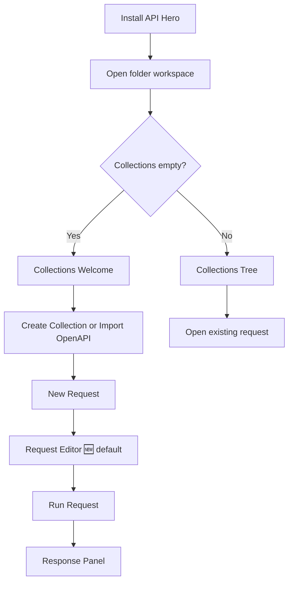
```mermaid
flowchart TD
  A[Install API Hero] --> B[Open folder workspace]
  B --> C{Collections empty?}
  C -->|Yes| D[Collections Welcome]
  D --> E[Create Collection or Import OpenAPI]
  E --> F[New Request]
  F --> G[Request Editor 🆕 default]
  G --> H[Run Request]
  H --> I[Response Panel]
  C -->|No| J[Collections Tree]
  J --> K[Open existing request]
```

**Success criteria:** User sees a 2xx (or intentional error) response without editing `.api` as text.  
**Current friction ⚠:** New Request opens text editor; custom editor is `option`.

---

## 2. Create collection

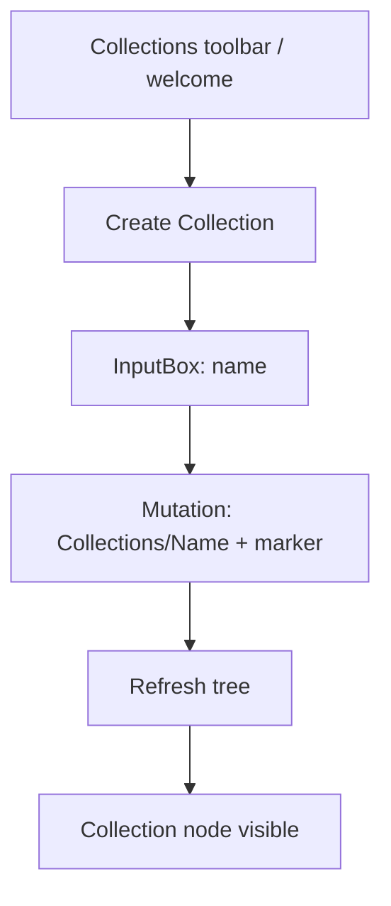
```mermaid
flowchart TD
  A[Collections toolbar / welcome] --> B[Create Collection]
  B --> C[InputBox: name]
  C --> D[Mutation: Collections/Name + marker]
  D --> E[Refresh tree]
  E --> F[Collection node visible]
```

**Status:** ✅ Native only.

---

## 3. Create folder

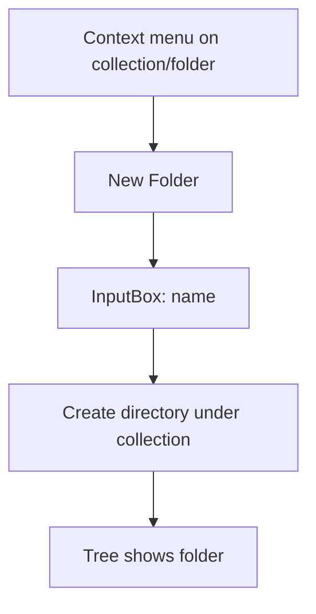
```mermaid
flowchart TD
  A[Context menu on collection/folder] --> B[New Folder]
  B --> C[InputBox: name]
  C --> D[Create directory under collection]
  D --> E[Tree shows folder]
```

**Status:** ✅ Native.

---

## 4. Create request

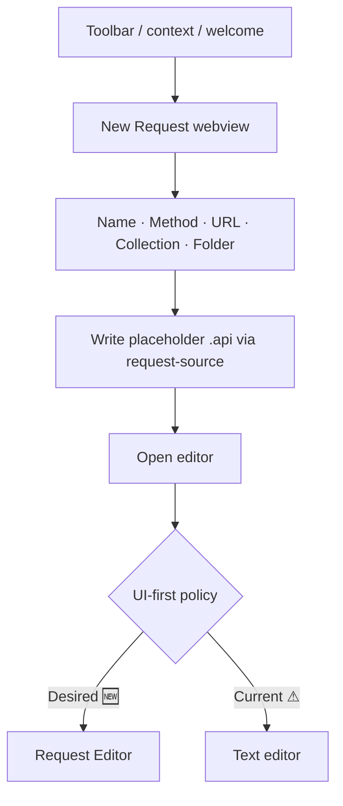
```mermaid
flowchart TD
  A[Toolbar / context / welcome] --> B[New Request webview]
  B --> C[Name · Method · URL · Collection · Folder]
  C --> D[Write placeholder .api via request-source]
  D --> E[Open editor]
  E --> F{UI-first policy}
  F -->|Desired 🆕| G[Request Editor]
  F -->|Current ⚠| H[Text editor]
```

**Fallback:** InputBox name-only if webview fails.  
**Status:** ✅ create · ⚠ open surface.

---

## 5. Import OpenAPI

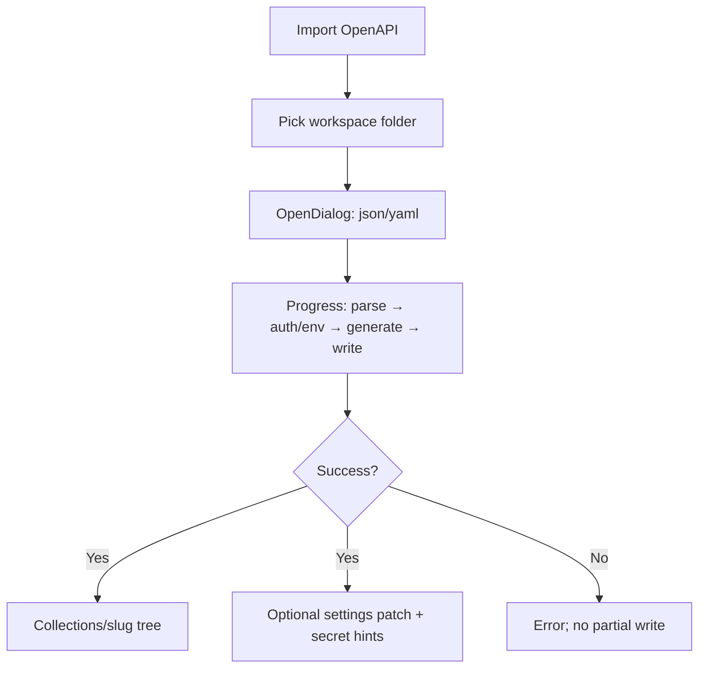
```mermaid
flowchart TD
  A[Import OpenAPI] --> B[Pick workspace folder]
  B --> C[OpenDialog: json/yaml]
  C --> D[Progress: parse → auth/env → generate → write]
  D --> E{Success?}
  E -->|Yes| F[Collections/slug tree]
  E -->|Yes| G[Optional settings patch + secret hints]
  E -->|No| H[Error; no partial write]
```

**Status:** ✅ OpenAPI 3.x only.

---

## 6. Run request

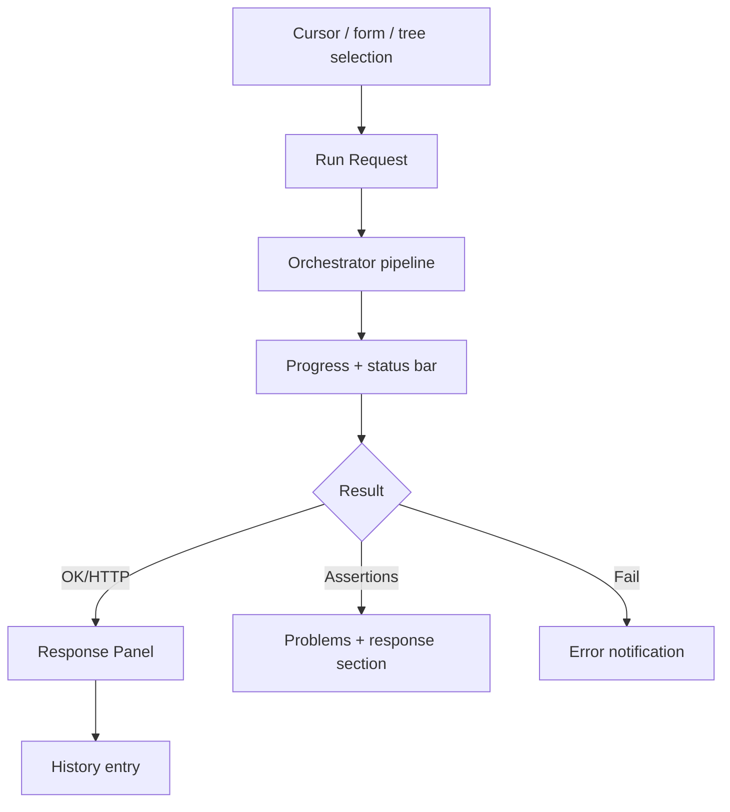
```mermaid
flowchart TD
  A[Cursor / form / tree selection] --> B[Run Request]
  B --> C[Orchestrator pipeline]
  C --> D[Progress + status bar]
  D --> E{Result}
  E -->|OK/HTTP| F[Response Panel]
  E -->|Assertions| G[Problems + response section]
  E -->|Fail| H[Error notification]
  F --> I[History entry]
```

**Entry points:** Keybinding, CodeLens, context menu, Request Editor Run, tree Run.  
**Status:** ✅

---

## 7. Run collection / folder / selection

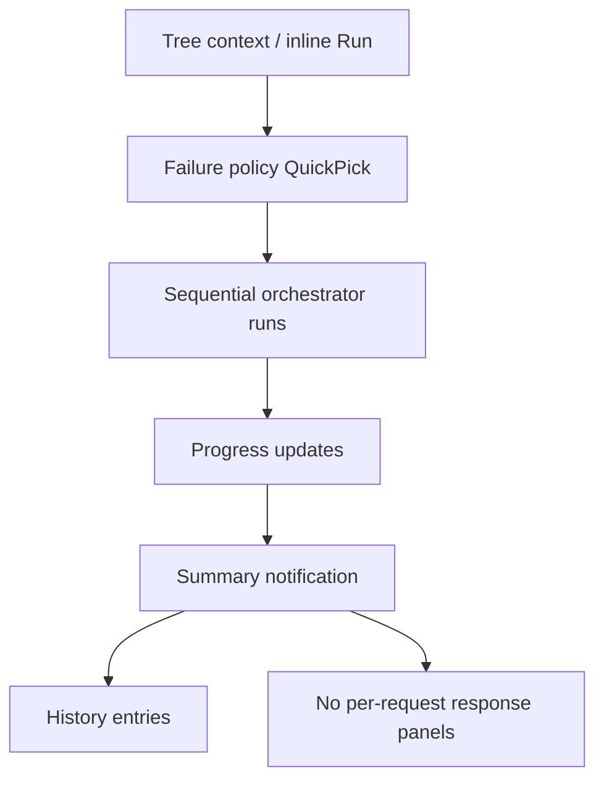
```mermaid
flowchart TD
  A[Tree context / inline Run] --> B[Failure policy QuickPick]
  B --> C[Sequential orchestrator runs]
  C --> D[Progress updates]
  D --> E[Summary notification]
  E --> F[History entries]
  E --> G[No per-request response panels]
```

**Variants:** Run Collection Tests (assertions on).  
**Status:** ✅ · ⚠ policy discoverability.

---

## 8. Manage environments

### Current

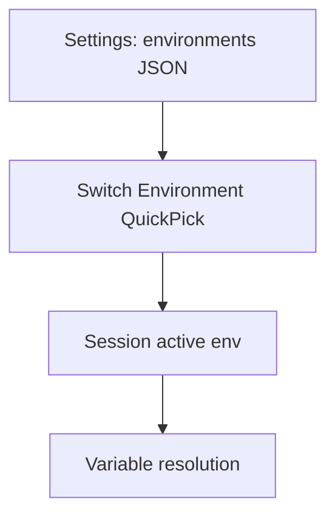
```mermaid
flowchart TD
  A[Settings: environments JSON] --> B[Switch Environment QuickPick]
  B --> C[Session active env]
  C --> D[Variable resolution]
```

### Desired 🆕

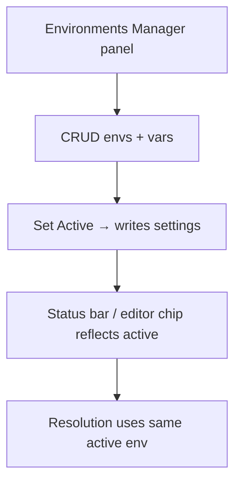
```mermaid
flowchart TD
  A[Environments Manager panel] --> B[CRUD envs + vars]
  B --> C[Set Active → writes settings]
  C --> D[Status bar / editor chip reflects active]
  D --> E[Resolution uses same active env]
```

**Entry:** Command / status bar / Request Editor — **not** Activity Bar.  
**Screen:** S25.

---

## 9. Create auth profile

### Current

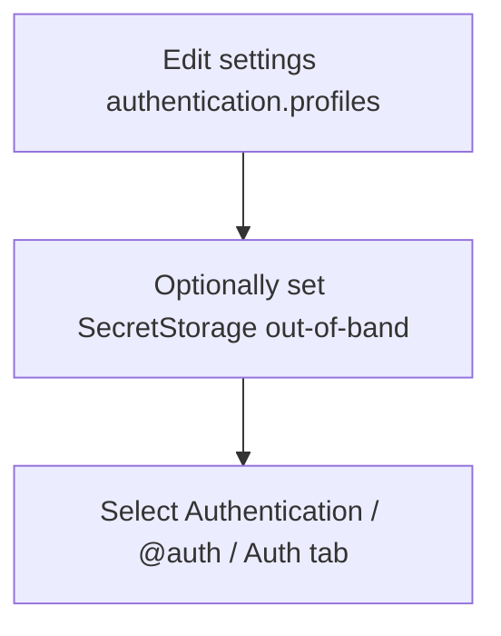
```mermaid
flowchart TD
  A[Edit settings authentication.profiles] --> B[Optionally set SecretStorage out-of-band]
  B --> C[Select Authentication / @auth / Auth tab]
```

### Desired 🆕

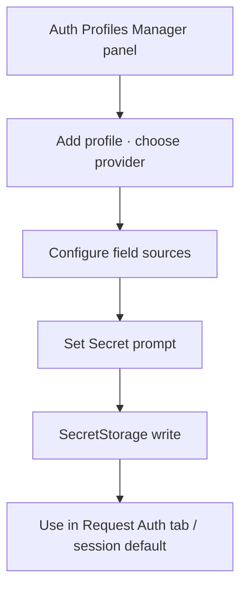
```mermaid
flowchart TD
  A[Auth Profiles Manager panel] --> B[Add profile · choose provider]
  B --> C[Configure field sources]
  C --> D[Set Secret prompt]
  D --> E[SecretStorage write]
  E --> F[Use in Request Auth tab / session default]
```

**Entry:** Command / Auth tab link — **not** Activity Bar.  
**Screen:** S27, S28.

---

## 10. Switch environment

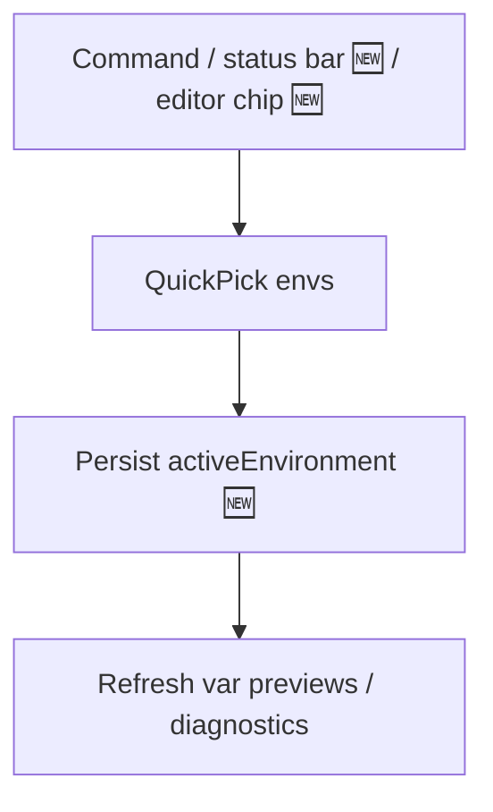
```mermaid
flowchart TD
  A[Command / status bar 🆕 / editor chip 🆕] --> B[QuickPick envs]
  B --> C[Persist activeEnvironment 🆕]
  C --> D[Refresh var previews / diagnostics]
```

**Current ⚠:** Session only; settings `activeEnvironment` may disagree.

---

## 11. View response

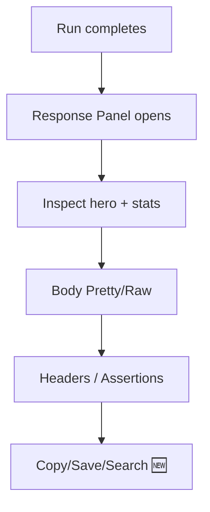
```mermaid
flowchart TD
  A[Run completes] --> B[Response Panel opens]
  B --> C[Inspect hero + stats]
  C --> D[Body Pretty/Raw]
  D --> E[Headers / Assertions]
  E --> F[Copy/Save/Search 🆕]
```

**Status:** ✅ view · 🆕 tools.

---

## 12. History

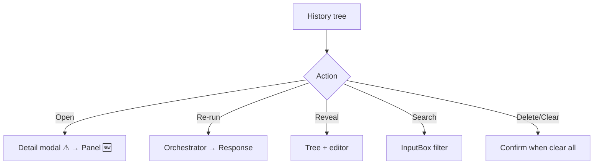
```mermaid
flowchart TD
  A[History tree] --> B{Action}
  B -->|Open| C[Detail modal ⚠ → Panel 🆕]
  B -->|Re-run| D[Orchestrator → Response]
  B -->|Reveal| E[Tree + editor]
  B -->|Search| F[InputBox filter]
  B -->|Delete/Clear| G[Confirm when clear all]
```

---

## 13. Export collection

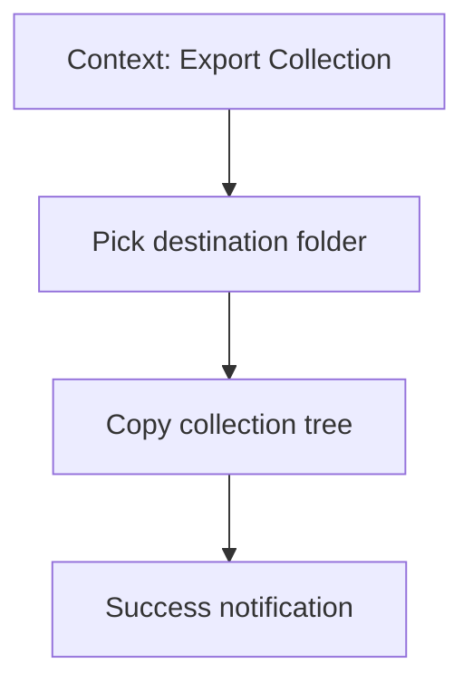
```mermaid
flowchart TD
  A[Context: Export Collection] --> B[Pick destination folder]
  B --> C[Copy collection tree]
  C --> D[Success notification]
```

**Future 🆕:** Zip export option.

---

## 14. Import collection

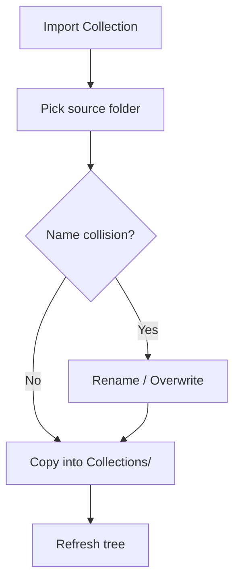
```mermaid
flowchart TD
  A[Import Collection] --> B[Pick source folder]
  B --> C{Name collision?}
  C -->|Yes| D[Rename / Overwrite]
  C -->|No| E[Copy into Collections/]
  D --> E
  E --> F[Refresh tree]
```

---

## 15. Editing (form)

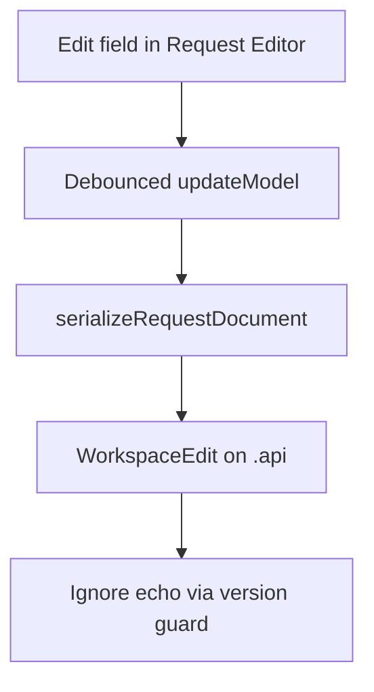
```mermaid
flowchart TD
  A[Edit field in Request Editor] --> B[Debounced updateModel]
  B --> C[serializeRequestDocument]
  C --> D[WorkspaceEdit on .api]
  D --> E[Ignore echo via version guard]
```

**Text path:** User types in buffer → parse → form refresh if editor open.

---

## 16. Deleting

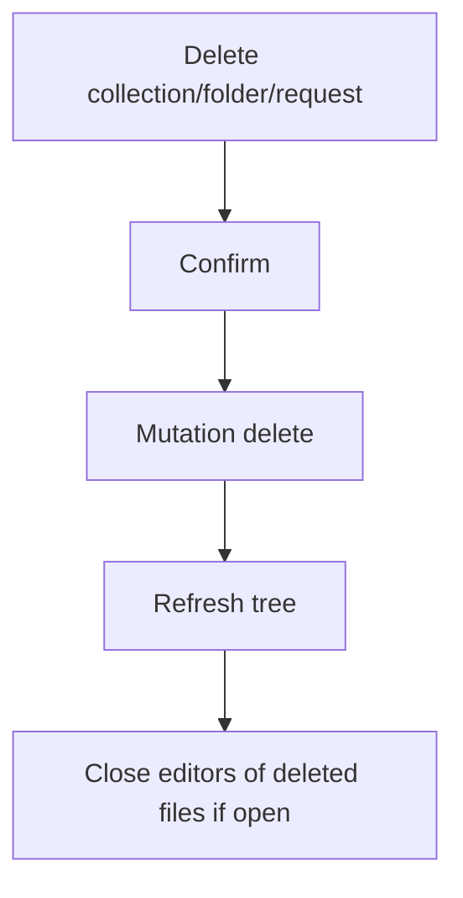
```mermaid
flowchart TD
  A[Delete collection/folder/request] --> B[Confirm]
  B --> C[Mutation delete]
  C --> D[Refresh tree]
  D --> E[Close editors of deleted files if open]
```

**Legacy:** Request delete supported; collection/folder delete limited.

---

## 17. Renaming

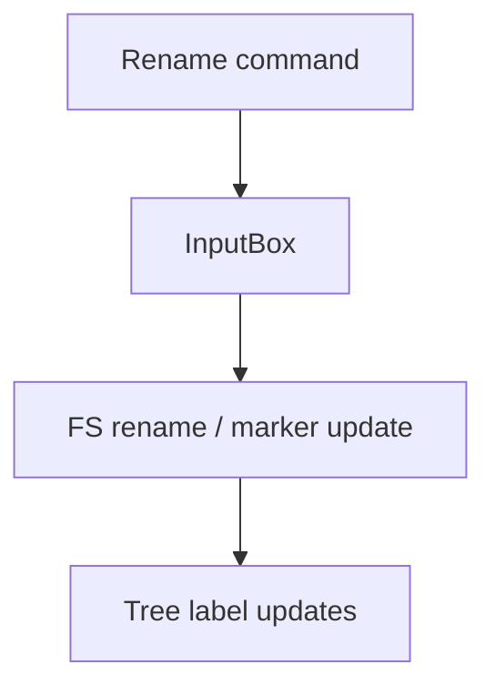
```mermaid
flowchart TD
  A[Rename command] --> B[InputBox]
  B --> C[FS rename / marker update]
  C --> D[Tree label updates]
```

**Status:** ✅ Native.

---

## 18. Moving

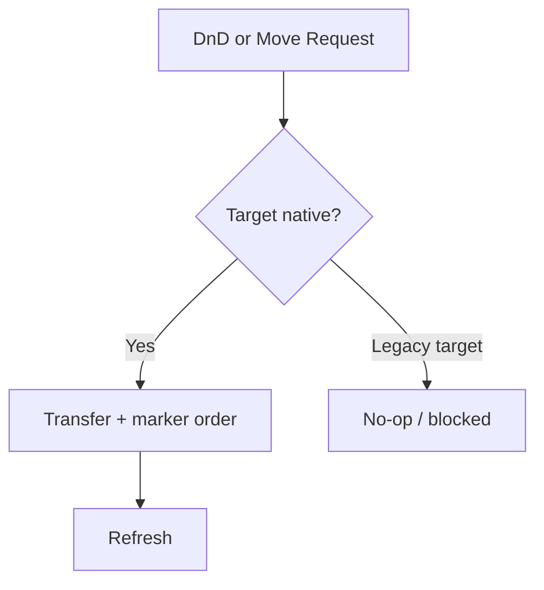
```mermaid
flowchart TD
  A[DnD or Move Request] --> B{Target native?}
  B -->|Yes| C[Transfer + marker order]
  B -->|Legacy target| D[No-op / blocked]
  C --> E[Refresh]
```

---

## 19. Duplicating

```mermaid
flowchart TD
  A[Duplicate collection/folder/request] --> B[Copy tree/file with new name]
  B --> C[Open duplicate optional]
  C --> D[Tree shows copy]
```

**Status:** ✅ Native.

---

## 20. Select authentication (session)

```mermaid
flowchart TD
  A[Select Authentication] --> B[QuickPick profiles]
  B --> C[Session default]
  C --> D[Applied when request lacks @auth]
```

**Desired 🆕:** Optional persist + Auth manager parity.

---

## 21. Run File (planned)

```mermaid
flowchart TD
  A[Run File command] --> B[Enumerate requests in document]
  B --> C[Sequential run with policy]
  C --> D[Summary + History]
```

**Status:** Stub → 🆕 implement using collection-runner patterns.

---

## 22. Login / Logout (planned redefine)

```mermaid
flowchart TD
  A[Login] --> B{Provider}
  B -->|OAuth2 🆕| C[Browser / device flow]
  B -->|Secret refresh 🆕| D[Set Secret prompt]
  C --> E[Token in SecretStorage]
  A2[Logout] --> F[Clear session tokens; keep profiles]
```

**Status:** Stub messages today — do not ship fake login.

---

## 23. Import Hub 🆕

```mermaid
flowchart TD
  A[Welcome / command / Overview] --> B[Import Hub panel]
  B --> C[Choose provider: OpenAPI / Postman / Zip / …]
  C --> D[Pick file + options]
  D --> E[Progress + cancel]
  E --> F{Success?}
  F -->|Yes| G[Collections/slug + optional secret CTAs]
  F -->|No| H[Error; no partial write]
```

**Screens:** S29, S18, S34. **Phase:** 5.  
**Entry:** Command / welcome — **not** Activity Bar.

---

## 24. Overview (orientation) 🆕

```mermaid
flowchart TD
  A[Command: Open Overview] --> B[Overview panel]
  B --> C[See env/auth chips + recent history]
  C --> D[Quick action: Create / Import / Manage Env / Manage Auth]
  D --> E[Opens Collections or manager panels]
```

**Screens:** S24. **Phase:** 8.  
**Must not** become a permanent Activity Bar view.

---

## 25. Walkthrough 🆕

```mermaid
flowchart TD
  A[First activate / Help] --> B[Walkthrough steps]
  B --> C[Reveal Collections]
  C --> D[Create request]
  D --> E[Run]
  E --> F[Switch environment]
  F --> G[Import OpenAPI]
```

**Screens:** S32. **Phase:** 5.  
**Must not** block extension activation.

---

## Flow → screen → interaction rules

| Flow | Screens | Interaction rules |
| --- | --- | --- |
| First launch | S02, S10, S06, S09 | No confirm on Run; Request Editor default |
| Create request | S10 → S06 | Dialog then editor; buffer dirty |
| Run request | S06/S08 → S09 | Progress <100 ms; same orchestrator |
| Manage env | S25, S13 | Panel; persist active; no Activity Bar |
| Manage auth | S27, S28 | Panel; SecretPrompt; no secrets in webview |
| History | S03 → S30 | Panel not modal |
| Import Hub | S29 | Progress + cancel; collision rules |

---

## Flow quality checklist

For each flow above, implementation must verify:

1. Achievable without hand-editing `.api` (except power-user flows)  
2. Writes go through mutation / serialize / settings services  
3. Errors leave workspace consistent  
4. Secrets never appear in webview state dumps  
5. Surfaces match [`information-architecture.md`](./information-architecture.md) (no new Activity Bar views)  
6. Confirmations follow [`interaction-model.md`](./interaction-model.md) § Confirmation  

---

## Related documents

- [`screen-list.md`](./screen-list.md)  
- [`north-star.md`](./north-star.md)  
- [`interaction-model.md`](./interaction-model.md)  
- [`gap-analysis.md`](./gap-analysis.md)  
- [`roadmap.md`](./roadmap.md)  
- [`component-library.md`](./component-library.md)  
